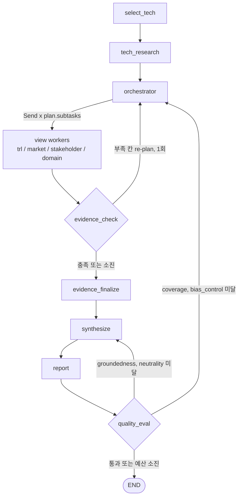

# KV cache 최적화 기술 다관점 평가 Multi-Agent Orchestration

본 프로젝트는 KV cache 최적화 기술을 소프트웨어, 하드웨어 두 진영에서 선정하여,
기술 성숙도, 시장성, 이해관계자, 도메인 적용 관점에서 평가하는 Orchestrator-Workers 패턴 기반으로 설계/개발 하는 프로젝트임.
RAG 실습(`dev` 브랜치)의 순차, 병렬 흐름을 같은 주제와 같은 코드 위에서 에이전트 패턴으로 바꾼 브랜치임.
RAG 실습 당시의 README(비교실험, 에이전트별 테스트 결과)는 [docs/rag-pipeline-readme.md](docs/rag-pipeline-readme.md)로 옮김.

## Overview

- Objective : 하나의 기술을 복수 관점에서 비교 평가
- Pattern : Orchestrator-Workers - 보고서 생성은 관점 4개와 기술 2개의 조사를 서로 독립적으로 나눠 병렬로 처리할 수 있는 작업이고, RAG 실습에서 이미 Send 병렬, 결과 병합 Reducer, 근거 번호 사후 확정을 갖춰 계획 단계만 더하면 됨. Supervisor는 기본이 순차 라우팅이라 실행 시간이 늘고, 재작업이 일어나지 않은 실행에서는 동적 동작이 드러나지 않음
- 동적 처리 : 어떤 worker를 몇 개, 무슨 일로 띄울지 코드가 미리 정하지 않음. 서브 태스크 단위는 (관점, 기술, 초점)이고 초점은 관점 필수 항목 하나(예: 시장성의 시장 규모, 채택 현황, 생태계, 반대 근거)에 대응함. orchestrator가 기술 조사 결과의 한계와 공백을 보고 칸마다 초점을 고른 뒤 그 수만큼 Send로 띄우고, 근거가 부족한 칸과 품질 평가에서 미달한 칸만 다시 계획(re-plan)함. 관점 4 x 기술 2 최소 범위는 fan-out이 아니라 계획 검증 단계가 보정하고 그 사유를 결정 로그에 남김

## Selected Technologies

- SW : TurboQuant - 기존 하드웨어를 그대로 두고 데이터만 줄이는 SW 진영의 발상을 가장 선명하게 대표함. 보정 데이터 없이 토큰이 들어오는 즉시 양자화할 수 있어 KV cache에 바로 맞고, 독립 검증 결과와 시장 반응 같은 4개 관점의 공개 자료가 있음
- HW : ITME - 데이터를 그대로 두고 담을 곳을 넓히는 HW 진영의 발상을 대표함. CXL-Hybrid 메모리 기반이라 새 인프라가 필요해 TurboQuant와 기술 성숙도 대비가 분명하고, prefix cache 접근 패턴을 활용해 평가 도메인(에이전트 코딩 멀티턴 서빙)과 직접 맞닿음

평가 도메인 : 에이전트형 AI 코딩 서비스의 멀티턴 장문맥 서빙

## Features

- PDF 자료 기반 정보 추출 : arXiv 논문 6편(136쪽)을 절 인식 청킹으로 색인해 tech_research, trl_eval, domain_eval이 검색
- 웹 검색 : Tavily, 0건이면 한국어, 영어, 앵커 제거 순서의 질의 사다리와 DuckDuckGo 폴백
- 동적 계획 : orchestrator(생성 LLM)가 칸마다 1~3개의 초점을 골라 계획을 세우고, 계획 검증이 카탈로그 밖 초점 제거, 대칭 보정(두 기술 동일 초점), 필수 초점(TRL 구간 추정), 빈 칸 보정, 균형 보정(반대 근거 초점만 있는 칸에 기본 초점 추가), 상한 조정을 수행. 초점과 질의 템플릿은 `src/common/focus.py` 카탈로그가 정본
- Fall-back : worker 실패 시 1회 재시도 후 제외하고 나머지 결과로 진행. 제외된 조사는 보고서 한계점에 기재
- 확증 편향 방지 전략 : 두 기술에 같은 질의 템플릿, 관점마다 반대 근거 전용 초점, evidence_check의 근거 수와 기술 간 비율 규칙, 생성과 다른 계열의 검수 모델
- 보고서 품질 평가 : 보고서 생성 뒤 Groundedness, 중립성, 편향 통제, 관점 커버리지를 Hybrid(규칙 + LLM Judge)로 판정하고 미달 시 Loop. 조사 부족은 재계획, 서술 문제는 재작성으로 나누고 예산도 따로 셈
- 근거 연결 : synthesize는 문장마다 근거 번호 목록을 구조화 출력으로 받고, 실제 근거 번호가 없는 문장은 코드가 제외함. 보고서 다듬기는 원문 인용이 하나라도 빠지면 원문으로 되돌리고, 칸당 주장은 출처가 겹치지 않는 쪽부터 실음
- 검수 LLM 검증 : 검수 모델의 지적은 보고서의 실제 문장과 대조해, 대조되지 않거나 근거 번호가 있는 문장에 대한 지적은 버림
- 관측성 : LangSmith Tracing과 결정 로그(JSONL)를 같은 `trace_id`로 연결
- 재개 : SQLite 체크포인터로 중단된 실행을 같은 `trace_id`에서 이어서 실행

## Tech Stack

- Framework : LangGraph 0.6
- LLM/Generator : GPT-5 mini (OpenAI API)
- LLM/Judge : Qwen3-8B (Ollama 로컬, 생성 모델과 다른 계열)
- Retrieval : FAISS Flat - Hit Rate@5 1.0(골든셋 role=target), MRR 0.892(camp 전체)
- Embedding : Qwen/Qwen3-Embedding-0.6B
- Observability : LangSmith, JSONL 결정 로그
- Checkpointer : langgraph-checkpoint-sqlite

## Agents

| 구분 | 노드 | 역할 |
|---|---|---|
| Orchestrator | `orchestrator` | 서브 태스크 목록(`Plan`, 보정 내역 포함)을 만들어 State에 저장. round 0은 LLM 계획과 계획 검증, round 1 이상은 부족 칸만 re-plan(그 칸에서 아직 조사하지 않은 초점 우선) |
| Worker | `trl_eval` | 초점: TRL 구간 추정, 실험 수준, 공개 구현, 제품화, 반대 근거(논문, 웹) |
| Worker | `market_eval` | 초점: 시장 규모, 채택 현황, 생태계, 반대 근거(웹) |
| Worker | `stakeholder_eval` | 초점: 경쟁 진영, 개발자와 도입 기업, 투자 업계, 반대 근거(웹) |
| Worker | `domain_eval` | 초점: 캐시 재사용, 응답 지연, 캐시 보관 비용, 정확도 유지, 도입 변경 범위, 반대 근거(논문, 웹) |
| Synthesizer | `synthesize` | worker 결과를 관점 간 일치점, 상충점, SUMMARY로 집계 |
| 점검 | `evidence_check` | 규칙 기반 근거 충분성 점검(근거 수, 반대 근거, 기술 간 비율, 그라운딩). 부족 칸을 orchestrator에 re-plan 요청 |
| 평가 | `quality_eval` | 보고서 품질 평가와 Loop 분기 |
| 기타 | `select_tech`, `tech_research`, `evidence_finalize`, `report` | 기술 선정 로드, 기술 조사, 근거 번호 확정, 보고서 조립(MD, PDF, JSON) |

## State Schema

정의는 [src/common/state.py](src/common/state.py)의 `AgentState`.

- 제어 vs 페이로드 분리 : `AgentState`를 작업 페이로드(기술, 관점 결과, 근거, 종합, 보고서 경로)와 제어 메타데이터(`trace_id`, `plan`, `plan_round`, `pending_gaps`, `retry_count`, `eval_count`, `node_status`, `last_error`, `step_count`) 구획으로 나눔. 라우팅 함수(`src/orchestration/routing.py`)는 제어 구획만 읽음
- 관측성 위치 : 결정과 사유는 State에 넣지 않음. orchestrator, evidence_check, quality_eval, worker Fall-back, 라우터가 `{trace_id, node, decision, reason, ts}`를 `output/logs/<trace_id>.jsonl`에 적재하고, LLM 호출 단위의 상세는 LangSmith 트레이스에 남김
- 지속성 비용 : worker에는 State 전체 대신 필요한 필드만 Send로 전달. 보고서 본문은 파일로만 두고 State에는 경로만 둠. 근거 원문은 200자 인용만 보관
- 상관 : `trace_id` 하나를 LangSmith metadata와 tag, 결정 로그 파일명, 체크포인트 `thread_id`, `report.json`에 함께 기록. 실행마다 LangSmith 루트 run id(`run_id`)를 직접 지정해 결정 로그와 `report.json`에도 남김
- 재개/복구 : SQLite 체크포인터에 superstep마다 저장. `python app.py --resume <trace_id>`로 마지막 체크포인트부터 재개. orchestrator가 계획 시점에 서브 태스크를 `node_status`에 pending으로 기록하고 worker가 done, excluded로 바꿈. 중단 뒤 pending으로 남은 작업이 미완료 작업임. 작업별 오류는 `task_errors`, 제외된 서브 태스크는 `excluded_subtasks`, 모든 round의 작업 목록은 `planned_subtasks`(report.json의 `tasks`)
- 동시 처리 : 동적 Fan-out에서 동시에 쓰는 필드는 모두 Reducer를 둠. 관점 결과는 기술 키 기준 이어 붙이기(`merge_view_results`, 그라운딩 필터와 번호 확정만 교체), 근거와 참고문헌은 `operator.add`, `node_status`는 dict 병합, `step_count`는 합산. 임시 근거 key에 (관점, round, 기술, 초점)을 넣어 같은 칸의 서브 태스크끼리 충돌하지 않게 함
- 종료 보장 : 재검색 1회(`retry_count`), 품질 재계획 `MAX_QUALITY_REPLANS`회(`quality_replan_count`), 재작성 `MAX_QUALITY_REWRITES`회(`quality_rewrite_count`), 노드 실행 수 `MAX_STEPS`(`step_count`), `recursion_limit`. 상한에 걸리면 Loop를 건너뛰고 종료 쪽으로 진행하며 사유를 결정 로그에 남김

## Architecture



### 보고서 품질 평가

| 평가 항목 | 방식 | 판정 | 미달 시 |
|---|---|---|---|
| Groundedness | 규칙 + 임베딩 + LLM | 인용 번호가 실제 근거인지, 인용 문장과 인용문의 코사인 유사도 비율, 근거 없는 사실 문장 | synthesize 재작성 |
| 중립성 | 규칙 + LLM | 우열 판정, 추천 금지 표현 목록과 검수 LLM 지적 | synthesize 재작성 |
| 편향 통제 | 규칙 | (관점, 기술)별 인용 출처 수, 기술별 반대 근거 인용, 기술 간 인용 수 비율 | 부족 칸 re-plan |
| 관점 커버리지 | 규칙 | 관점별 평가 절에 4개 관점 x 기술 모든 칸의 인용 존재 | 부족 칸 re-plan |

조사와 서술이 모두 미달이면 재조사를 먼저 하고, 재조사 뒤 다시 실행되는 synthesize가 서술 지적도 함께 반영함.
판정 결과는 `output/report.json`의 `quality_eval`, `quality_eval_history`에 남고, 최종 판정은 보고서 한계점 절의 "최종 품질 평가 결과" 표로도 실림.

## Directory Structure

```
├── app.py                     # 실행 스크립트 (실행, 재개)
├── configs/tech_selection.json  # 선정 기술과 도메인 (Human 기반 선정)
├── data/doc_pool/             # 문서 풀 (arXiv PDF 6편, git 미추적)
├── src/
│   ├── graph.py               # 그래프 조립과 통합 실행
│   ├── orchestration/         # 조정 계층
│   │   ├── orchestrator.py         # Orchestrator: 서브 태스크 계획, re-plan
│   │   ├── routing.py         # Dynamic Fan-out, 조건 분기
│   │   ├── worker.py          # 노드 공통 래퍼, worker Fall-back
│   │   └── checkpoint.py      # 체크포인터
│   ├── agents/                # 하위 에이전트 (각 폴더의 agent.py)
│   │   ├── trl_eval/ market_eval/ stakeholder_eval/ domain_eval/   # workers
│   │   ├── synthesize/        # synthesizer
│   │   ├── evidence_check/ quality_eval/
│   │   └── select_tech/ tech_research/ report/ judge/
│   └── common/                # State, 초점 카탈로그(focus.py), 도구, 모델 로더, 근거 번호 확정, 관측성
├── scripts/                   # 에이전트별 테스트 러너, 그래프 흐름 검증
├── eval/golden/               # 검색 평가 골든셋
├── docs/                      # 설계서, RAG 실습 README
└── output/                    # 실행 결과 저장 (보고서, 결정 로그, 체크포인트, git 미추적)
```

`judge/`는 단독 검수 에이전트로 남겨 두었고, 통합 그래프에서는 `quality_eval`이 같은 검수 모델로 중립성 판정을 맡음.

## Usage

```bash
pip install -r requirements.txt
cp .env.example .env           # OPENAI_API_KEY, TAVILY_API_KEY, LANGSMITH_API_KEY 입력
ollama pull qwen3:8b           # 검수 모델

python app.py                  # 실행. 끝나면 trace_id와 실행 요약 출력
python app.py --resume <trace_id>   # 중단된 실행 재개
python -m scripts.graph_flow_check  # API 키 없이 그래프 흐름 검증(stub)
```

실행 결과는 `output/report.md`, `output/report.pdf`, `output/report.json`, 결정 로그는 `output/logs/<trace_id>.jsonl`.
LangSmith에서는 프로젝트 `LANGSMITH_PROJECT`의 `trace:<trace_id>` 태그로 같은 실행을 찾음.

## Contributors

- 박기연 : RAG 실습의 이해관계자, 도메인 평가 에이전트와 대칭 질의 템플릿 / Agent 실습의 Orchestrator-Workers 전환(orchestrator, Dynamic Fan-out, worker Fall-back, quality_eval, State Schema 재구획, 관측성과 체크포인트)
- 신소영 : RAG 파이프라인 설계(청크 분할, 메타데이터 스키마), 임베딩 모델 선정, FAISS 색인과 검색 평가 스크립트
- 최광원 : 생성, 검수 LLM 선정과 프롬프트 템플릿, OpenAI 연동과 Ollama 검수 모델 서빙
- 문관록 : 시장 평가 에이전트, Tavily 웹 검색 도구
- 임채현 : State, Graph 아키텍처, 근거 점검 재시도 로직, 기술 성숙도 에이전트
