# KV cache 최적화 기술 평가 보고서 생성 Agent

SW(TurboQuant)와 HW(ITME) 두 KV cache 최적화 기술을, 기술 성숙도·시장성·이해관계자·
도메인 적용 네 관점에서 비교하는 LangGraph 기반 Multi-Agent 평가 보고서 생성기.
설계 근거는 [docs/agentic-rag-design.md](docs/agentic-rag-design.md), 테스트 계획은
[docs/schedule.md](docs/schedule.md) 참고.

## 목차

1. [개요](#1-개요)
2. [선정 기술 및 모델 근거](#2-선정-기술-및-모델-근거)
   - 2.1 [대상 기술](#21-대상-기술)
   - 2.2 [RAG 설정 비교실험](#22-rag-설정-비교실험-청킹--임베딩--query-rewriting)
   - 2.3 [생성·검수 LLM 선정](#23-생성검수-llm-선정)
3. [아키텍처](#3-아키텍처)
   - 3.1 [Graph 흐름](#31-graph-흐름)
   - 3.2 [디렉토리 구조](#32-디렉토리-구조)
   - 3.3 [State 설계 요약](#33-state-설계-요약)
   - 3.4 [파일별 역할](#34-파일별-역할)
4. [에이전트별 테스트 검증](#4-에이전트별-테스트-검증)
   - 4.1 [RAG 3종](#41-rag-3종-tech_research--trl_eval--domain_eval)
   - 4.2 [규칙 기반 에이전트](#42-규칙-기반-에이전트-select_tech--evidence_check)
   - 4.3 [생성 평가 에이전트](#43-생성-평가-에이전트-market_eval--stakeholder_eval--synthesize)
   - 4.4 [검수·보고서 에이전트](#44-검수보고서-에이전트-judge--report)
5. [개발 환경 설정](#5-개발-환경-설정)
   - 5.1 [기본 설치](#51-기본-설치)
   - 5.2 [Ollama 설치](#52-ollama-설치-및-실행-검수-모델-qwen3-8b-63절)
   - 5.3 [Doc Pool 준비](#53-doc-pool-준비-rag-3종에만-필요)
   - 5.4 [Golden Dataset 생성](#54-golden-dataset-생성-최초-1회-팀-공용-rag-3종에만-필요)
6. [실행 방법](#6-실행-방법)
   - 6.1 [에이전트별 개별 테스트](#61-에이전트별-개별-테스트-팀원이-각자-독립적으로)
   - 6.2 [통합 실행](#62-통합-실행)
7. [다음 단계](#7-다음-단계)
8. [알려진 한계와 설계 결정 근거](#8-알려진-한계와-설계-결정-근거)
9. [Contributors](#9-contributors)

---

## 1. 개요

이 저장소는 **설계서의 10개 비즈니스 에이전트와 통합 Graph**를 갖추고 있음. RAG를
실제로 쓰는 3개(`tech_research`, `trl_eval`, `domain_eval`, 4·5장)와 RAG를 쓰지
않는 7개(`select_tech`, `market_eval`, `stakeholder_eval`, `evidence_check`,
`synthesize`, `judge`, `report`)가 각각 `src/agents/{agent}/`, `scripts/{agent}/`에
대응함. `src/graph.py`는 병렬 관점 실행, 최대 1회 재검색, Evidence ID 최종화,
종합·검수·보고서 흐름을 연결함.

> **검색 설정 채택안** (근거는 2장, 실측 데이터는 `scripts/{rag 3종}/*_report.md`)
> 절 인식 청킹(800자/overlap 120) + `Qwen/Qwen3-Embedding-0.6B` + Query Rewriting 끔.
> `.env`의 `QUERY_REWRITING=1`로 리라이팅을 다시 켤 수 있음. RAG 3종은 이 설정으로
> 구현이 끝나 있으며 `python -m scripts.run_rag_agents`로 그래프 없이 실제 순서대로
> 돌려 볼 수 있음.

---

## 2. 선정 기술 및 모델 근거

### 2.1 대상 기술

`configs/tech_selection.json`에서 읽어오는 값(3장, Human 기반 선정):

| 기술 | 진영 | 역할 | 검색 앵커 | 선정 사유 |
|---|---|---|---|---|
| **TurboQuant** | SW | target | Google | 보정 데이터 없이 토큰이 들어오는 즉시 양자화 가능. 채널당 3.5비트에서 품질 저하 없음을 보고 |
| **ITME** | HW | target | SK hynix | CXL-Hybrid 메모리로 TB 규모 원격 메모리 제공. prefix cache의 예측 가능한 접근 패턴을 활용해 GPU로 사전 이동 |

평가 도메인: **"에이전트형 AI 코딩 서비스의 멀티턴 장문맥 서빙"**(2장) — 코딩 에이전트는
세션당 턴 수 중앙값 43, 입력 길이 중앙값 142K 토큰(vLLM Team, 2026)으로 KV cache를
세션 내내 보관해야 해 캐시 크기·보관 비용이 서비스 원가에 직결됨.

선정 이유(3장 요약): ① SW/HW 두 진영의 발상을 가장 선명하게 대표(데이터를 줄이는
TurboQuant vs 담을 곳을 넓히는 ITME), ② 기술 성숙도 단계가 뚜렷이 다름(소프트웨어만으로
적용 가능 vs 새 인프라 필요), ③ 4개 관점 모두에서 확인할 공개 자료가 존재.

### 2.2 RAG 설정 비교실험 (청킹 / 임베딩 / Query Rewriting)

| 에이전트 | 책임 | 도구 | RAG | 입력 | 출력 |
|---|---|---|---|---|---|
| 기술 선정 `select_tech` | 선정 기술과 도메인을 설정에서 읽어 옴 | 없음 | X | 설정 파일 | `techs`, `domain` |
| 기술 조사 `tech_research` | 논문에서 기술 개요, 적용 범위, 한계, 같은 진영 다른 방식과의 차이를 추출 | 논문 검색 | O | `techs` | `tech_profiles` |
| 기술 성숙도 `trl_eval` | TRL 구간을 추정하고 근거와 정보 공백을 정리 | 논문 검색, 웹 검색 | O | `tech_profiles` | `trl_result` |
| 시장 평가 `market_eval` | 시장 규모와 성장성, 채택 현황, 생태계 지지를 조사 | 웹 검색 | X | `tech_profiles`, `techs` | `market_result` |
| 이해관계자 평가 `stakeholder_eval` | 경쟁 진영, 도입 기업과 개발자, 투자 업계의 반응을 조사 | 웹 검색 | X | `tech_profiles`, `techs` | `stakeholder_result` |
| 도메인 평가 `domain_eval` | 에이전트 코딩 서비스의 멀티턴 장문맥 서빙에 도입할 때의 조건과 장벽을 정리 | 논문 검색, 웹 검색 | O | `tech_profiles`, `domain` | `domain_result` |
| 근거 점검 `evidence_check` | 관점별 근거 수, 반대 근거 유무, 기술 간 균형을 점검하고 부족한 관점을 재검색 대상으로 지정 | 없음 | X | 관점 결과 4종, `evidence` | `retry_targets`, `retry_count` |
| 평가 종합 `synthesize` | 관점 사이의 일치와 상충을 정리 | 없음 | X | 관점 결과 4종 | `synthesis` |
| 중립성 검수 `judge` | 우열 판정 표현, 출처 없는 문장, 기술 간 서술 불균형을 검사 | 없음 | X | `synthesis`, `evidence` | `judge_feedback` |
| 보고서 생성 `report` | 목차에 맞춰 보고서를 조립하고 PDF로 변환 | 없음 | X | State 전체 | `report_md`, `report_path` |


RAG를 쓰는 3개 에이전트(`tech_research`/`trl_eval`/`domain_eval`)가 각자 독립
`scripts/{agent}/test_runner.py`로 같은 3가지를 비교실험함(schedule.md 3.1~3.3절).
청킹·임베딩은 3개 에이전트가 공유하는 전역 색인 설정이라 전체 30개 골든셋으로,
Query Rewriting은 에이전트가 실제로 던지는 질의 유형이 달라 에이전트별 관점 질의로
채점함(자세한 수치표는 각 `scripts/{agent}/{agent}_report.md` 참고).

#### tech_research

| 항목 | 결과 |
|---|---|
| 청킹(MRR, camp 전체) | 절 인식 0.892 vs naive 0.967 |
| 임베딩(MRR, camp 전체) | bge-m3 0.844 / multilingual-e5-large 0.867 / **Qwen3-Embedding-0.6B 0.892** |
| Query Rewriting(MRR, camp 전체) | 원본 1.000 vs 리라이팅 0.964 |

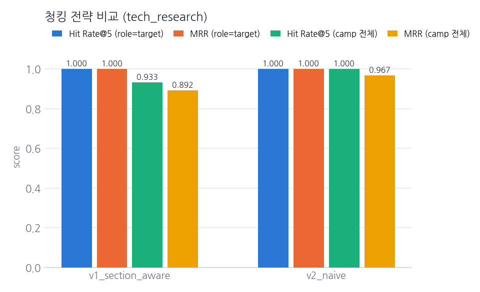

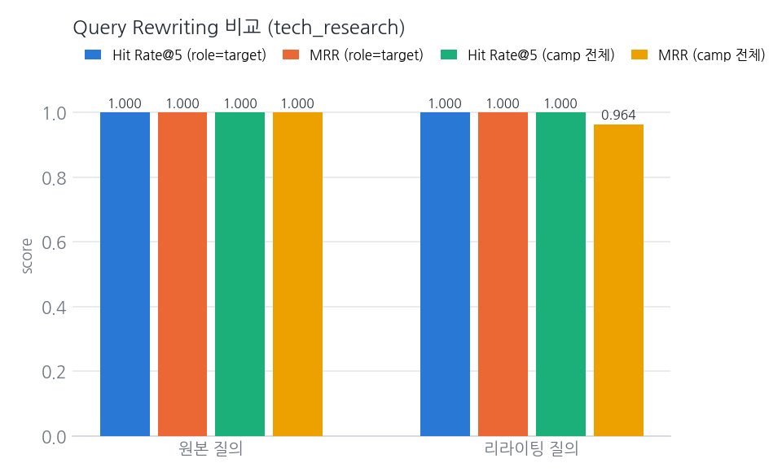

#### trl_eval

| 항목 | 결과 |
|---|---|
| 청킹(MRR, camp 전체) | 절 인식 0.892 vs naive 0.967 |
| 임베딩(MRR, camp 전체) | bge-m3 0.844 / multilingual-e5-large 0.867 / **Qwen3-Embedding-0.6B 0.892** |
| Query Rewriting(MRR, camp 전체) | 원본 0.750 vs **리라이팅 0.833** |

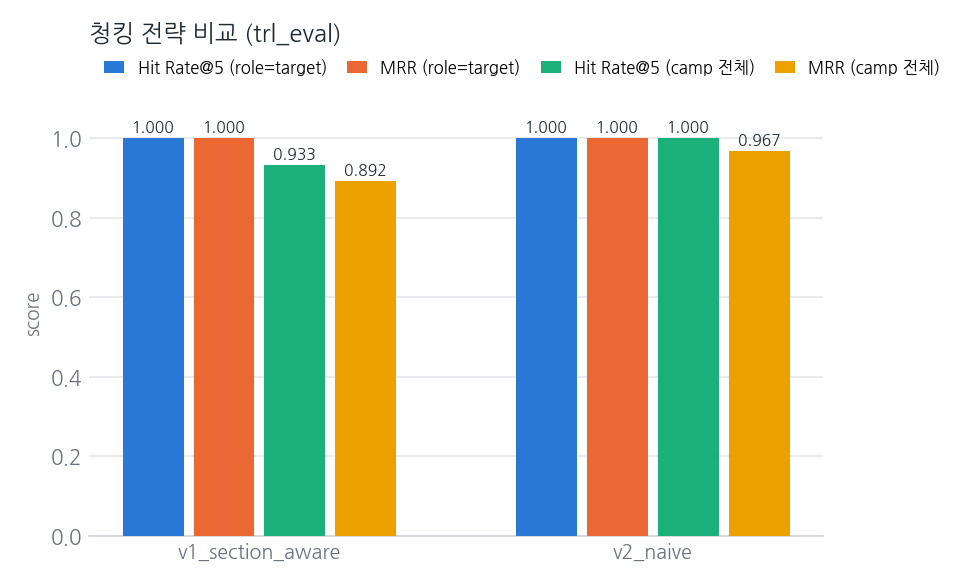
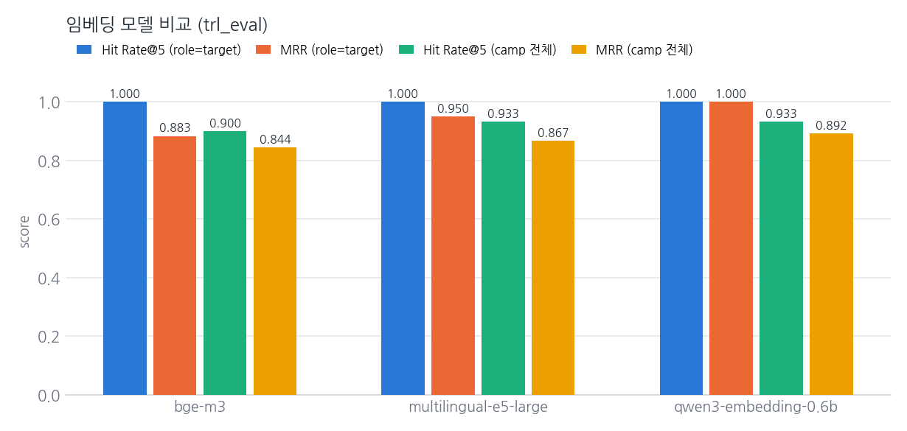
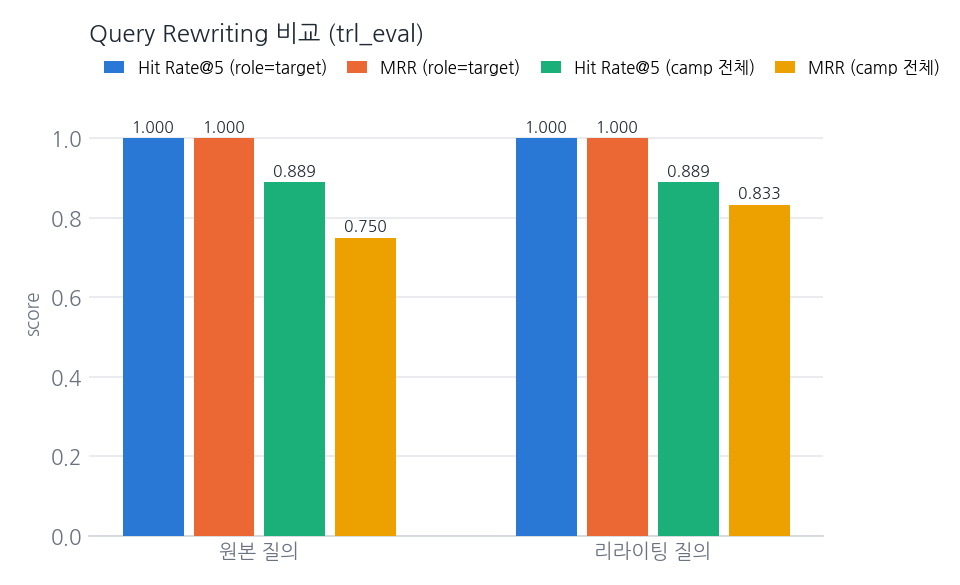

#### domain_eval

| 항목 | 결과 |
|---|---|
| 청킹(MRR, camp 전체) | 절 인식 0.892 vs naive 0.967 |
| 임베딩(MRR, camp 전체) | bge-m3 0.844 / multilingual-e5-large 0.867 / **Qwen3-Embedding-0.6B 0.892** |
| Query Rewriting(MRR, camp 전체) | 원본 0.857 vs 리라이팅 0.786 |

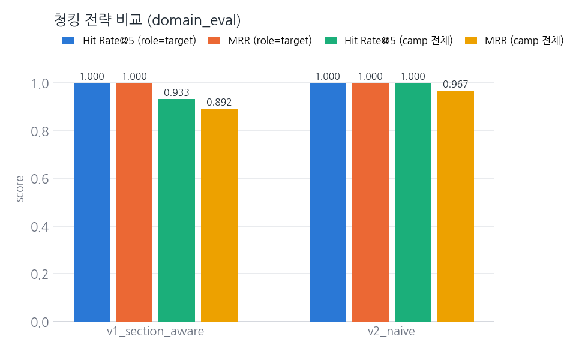

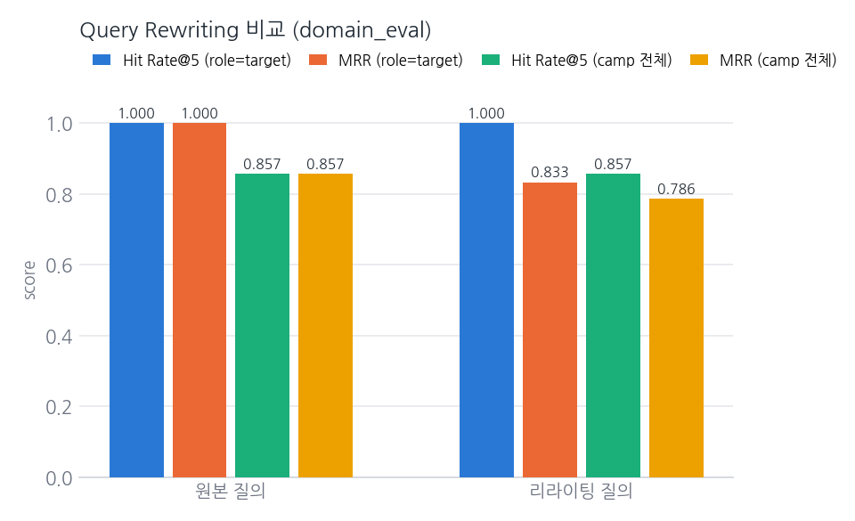

#### 최종 채택 및 근거

| 항목 | 설계서 초안(6.1·7.2~7.4절) | 실측 결과 | 채택 |
|---|---|---|---|
| 임베딩 | bge-m3 | 3개 에이전트 전부 Qwen3-Embedding-0.6B가 MRR 최고 | **Qwen3-Embedding-0.6B로 교체** |
| 청킹 | 절 인식(aware) | 3개 에이전트 전부 naive가 MRR 더 높음 | **절 인식(aware) 유지** |
| Query Rewriting | 적용 | tech_research·domain_eval은 원본이 같거나 높고, trl_eval만 리라이팅이 근소하게 높음(3개 중 2개 일치) | **끔**(`.env`에서 재활성화 가능) |

- **임베딩**은 세 에이전트 결과가 일치해 바로 교체함.
- **청킹**은 naive가 수치상 더 높지만 절 인식을 그대로 유지함. Doc Pool이 지금은
  6편·136쪽뿐이라 절 경계가 크게 안 다치지만, 문서가 더 쌓이면 절 인식 없이 슬라이싱한
  청크는 문맥이 끊겨 손해가 커질 것으로 판단함. 정답 판정 자체가 쪽 번호 기반이라
  naive가 유리하게 측정됐을 가능성도 있음(`src/common/tools.py` 주석 참고).
- **Query Rewriting**은 다수결(3개 중 2개)로 껐음 — 완전히 일치한 결론은 아니라서,
  `trl_eval`은 여전히 리라이팅이 근소하게 나은 채로 남아 있음.

### 2.3 생성·검수 LLM 선정

| 역할 | 모델 | 선정 이유(6.2·6.3절) |
|---|---|---|
| 생성(Generator) | GPT-5 mini (OpenAI API) | Structured Outputs strict 모드로 스키마 준수 보장, 관점 4개 병렬 호출에 지연 낮음, 16K 이상 문맥과 안정적 한국어 |
| 검수(Judge) | Qwen3-8B (Ollama 로컬) | 생성 모델과 다른 계열이어야 자기 선호 편향을 구조적으로 피함(Zheng et al., 2023). 4비트 양자화로 16GB 메모리 예산 안에 들어옴 |

두 모델이 실제로 정확도 있는 판정을 하는지는 4장의 루브릭·스팟체크 결과로 검증함.

---

## 3. 아키텍처

### 3.1 Graph 흐름

`src/graph.py`가 실제로 연결하는 순서(12장). 관점 노드 4개는 `Send`로 (관점,
기술) 단위 병렬 실행되고(아래는 관점 단위로 단순화해 표시), 재검색·재작성은
각각 최대 1회임.

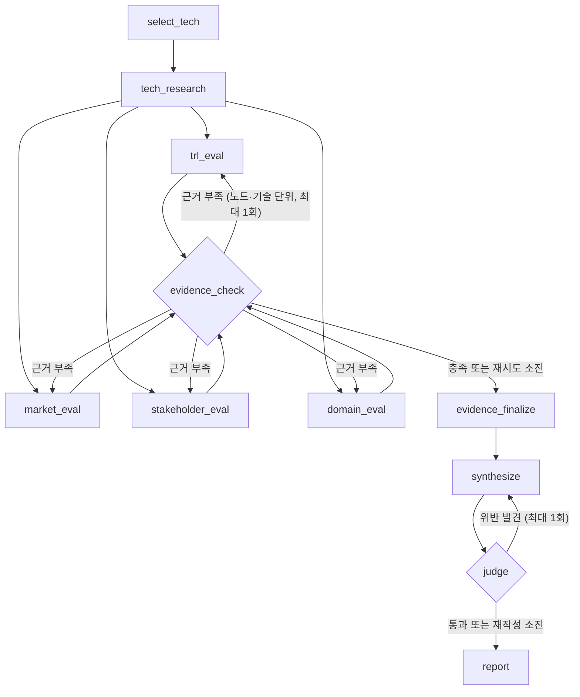

### 3.2 디렉토리 구조

```
skala-rag/
├── .env.example            # 환경 변수 템플릿
├── requirements.txt         # 팀 공통 패키지 버전
├── configs/
│   └── tech_selection.json  # select_tech가 읽는 기술 선정 결과 (3장, Human 기반)
├── docs/                    # 설계서, 테스트 계획 (원본)
├── assets/
│   └── fonts/NanumGothic-Regular.ttf  # report PDF 한글 폰트 (OFL, xhtml2pdf는 시스템 폰트로 폴백하지 않음)
├── data/
│   └── doc_pool/            # Doc Pool PDF 6편 (gitignore, 직접 내려받아 채움)
├── output/                  # report 산출물 report.md / report.pdf / report.json (gitignore)
├── src/
│   ├── graph.py               # 10개 노드를 잇는 LangGraph 그래프 (12장) — 통합 실행 진입점
│   ├── common/               # 10개 에이전트 + 테스트 스크립트가 공유하는 공통 모듈
│   │   ├── config.py          # .env 로더
│   │   ├── state.py           # LangGraph State (11장)
│   │   ├── evidence.py        # 임시 Evidence key 발급·최종 ID 확정
│   │   ├── models.py          # 생성/검수 LLM, 임베딩 로더 (6장)
│   │   ├── tools.py           # paper_search, web_search, summarize_sources, PDF 로딩/청킹
│   │   ├── base_agent.py      # 에이전트 노드 공통 인터페이스
│   │   ├── doc_pool.py         # Doc Pool 6편 스펙 (5장 표)
│   │   └── eval_utils.py       # Hit Rate@K/MRR·루브릭·단위테스트용 그래프 (테스트 스크립트 공용)
│   └── agents/                # 10개 에이전트 노드 (총 10개 폴더)
│       ├── select_tech/agent.py        # 7.1절 — RAG 미사용, 규칙 기반
│       ├── tech_research/agent.py      # 7.2절 — RAG 사용
│       ├── trl_eval/agent.py           # 7.3절 — RAG 사용
│       ├── market_eval/agent.py        # 7.5절 — RAG 미사용, 웹 검색만
│       ├── stakeholder_eval/agent.py   # 7.6절 — RAG 미사용, 웹 검색만
│       ├── domain_eval/agent.py        # 7.4절 — RAG 사용
│       ├── evidence_check/agent.py     # 7.7절 — RAG 미사용, 규칙 기반
│       ├── synthesize/agent.py         # 7.8절 — RAG 미사용, 생성만
│       ├── judge/agent.py              # 7.9절 — RAG 미사용, Qwen3-8B 이진 판정 + judge_passed()
│       └── report/agent.py             # 7.10절 — RAG 미사용, 챕터 직렬화 + 인용 안전장치 + MD/PDF/JSON
├── scripts/                  # 에이전트별 독립 테스트 환경 (총 10개, 서로 영향 없음)
│   ├── tech_research/
│   │   ├── pdf/v1/index/      # 절 인식 청킹 버전 FAISS 색인 (gitignore)
│   │   ├── pdf/v2/index/      # naive 슬라이싱 비교 버전 FAISS 색인 (gitignore)
│   │   ├── index_config.py    # 청킹/임베딩 비교실험 설정
│   │   ├── test_runner.py     # Hit Rate@5·MRR 측정 + 그래프 + 리포트 생성
│   │   └── tech_research_report.md  # 실행 결과물 (팀 공유용, git 추적함)
│   ├── trl_eval/, domain_eval/   # 위와 동일 구조(RAG 3종)
│   ├── select_tech/, evidence_check/, judge/   # 단위 테스트 / 스팟체크 test_runner.py
│   └── market_eval/, stakeholder_eval/, synthesize/, report/  # 8.2 루브릭 test_runner.py
└── eval/
    ├── generate_golden_dataset.py  # LLM 합성 Golden Dataset 생성 파이프라인 (8.4절)
    └── golden/golden_dataset.json  # 생성 결과 (팀 공용, git 추적함)
```

### 3.3 State 설계 요약

`src/common/state.py`가 11장 표를 그대로 구현함. 핵심만 짚으면:

- 병렬 노드는 `raw_evidence`, `raw_references`를 `Annotated[list[...], operator.add]` reducer로 누적함. `evidence_finalize`가 재시도까지 끝난 뒤 결정적인 순서로 정렬해 `evidence`와 `references`에 연속 ID를 부여함. 보고서와 인용 검증은 확정 영역을 사용함.
- `evidence_check`는 근거량·균형뿐 아니라 Claim의 provisional key/최종 ID와 인용문 임베딩을 확인하고, `perspective_confidence`를 계산해 `synthesize`에 전달함.
- `Synthesis`에는 관점별 신뢰도, 전체 평균(`overall_confidence`), 가장 낮은 관점(`weakest_perspective`)이 코드로 집계되어 저장됨.
- `Evidence.perspective`는 설계서 4개 관점(`trl`/`market`/`stakeholder`/`domain`)에 조사 단계인 `tech_research`를 더해 5가지 값을 가짐 — "조사와 관점 에이전트는 공통으로 evidence에도 기록함"(4장)을 반영
- `ViewResult`는 `by_tech: dict[기술명, TechViewResult]` 형태로 두 기술을 나란히 담음(9.5절 "두 기술을 나란히 서술")
- 관점 노드 4개는 `graph.py`가 `Send`로 (관점, 기술) 단위로 호출함. 각 호출은 state에 `tech_scope`(기술명 하나)를 받아 `BaseAgent.scoped_techs`로 그 기술만 처리하고, 같은 관점 필드(`trl_result` 등)에 동시에 쓰는 결과는 `merge_view_results` reducer가 기술 키로 합침. 독립 실행 스크립트처럼 `tech_scope` 없이 부르면 techs 전체를 처리함
- `retry_targets`에는 관점 코드(`trl`)가 아니라 실제 노드 이름(`trl_eval`)이 들어가고, `retry_scopes`에는 노드별로 부족한 기술 목록이 들어감 — `evidence_check`가 세 규칙을 기술별로 평가해 채우고, `graph.py`가 부족한 (노드, 기술)만 `Send`로 다시 실행하며, 각 관점 노드는 `self.name in state["retry_targets"]`로 재검색 초점을 바꿈(12장 "반복 1")
- `rewrite_count`는 11장 표에 없지만 `retry_count`의 짝으로 추가함 — `synthesize`가 `judge_feedback`을 받아 다시 쓴 횟수를 기록하고, `graph.py`의 `judge` 뒤 조건 분기가 이 값으로 재작성 예산(1회)을 확인함(12장 "반복 2")

### 3.4 파일별 역할

| 파일 | 역할 |
|---|---|
| `src/graph.py` | 12장 그래프 조립. `build_graph(nodes)`에 노드 이름→callable dict를 넣으면 `select_tech → tech_research → 관점 4종 × 기술 N(Send로 병렬) → evidence_check → (부족한 관점·기술 조합만 재검색 1회) → evidence_finalize → synthesize → judge → (위반 시 재작성 1회) → report` 순서로 잇고, `make_agents()`가 실제 에이전트 10개를 만들어 줌. `python -m src.graph`로 통합 실행 |
| `scripts/graph_flow_check.py` | API 키·PDF 없이 stub 노드로 그래프 흐름 검증(fan-out 8회, by_tech 병합, 기술 단위 재검색, key 충돌 없음, 재작성 1회). `python -m scripts.graph_flow_check` |
| `src/common/state.py` | `AgentState`(TypedDict) + `TechSpec`/`TechProfile`/`Evidence`/`Reference`/`ViewResult`/`Synthesis`/`JudgeFeedback`. 11장 표의 필드명·타입·갱신 방식(덮어쓰기/누적)을 그대로 구현함 |
| `src/common/evidence.py` | 병렬 수집용 provisional key 발급, 재시도 후 결정적 정렬·ID 부여, Claim/TechProfile/Reference remap |
| `src/common/models.py` | `get_generation_llm()`(GPT-5 mini), `get_judge_llm()`(Qwen3-8B, Ollama), `get_embedding_model()`(bge-m3). 3.1절 비교실험용 `get_embedding_model_by_name()` 포함 |
| `src/common/tools.py` | PDF 로딩(PyMuPDF) → 절 구조 인식(정규식) → 절 경계 내 청킹 → FAISS 색인(`build_doc_pool_index`), 공유 색인 로더(`get_shared_index`, `DOC_POOL_INDEX_DIR/<임베딩>/`), `paper_search`(role/camp/tech 사전 필터, 전체 벡터 대상), `web_search`(Tavily, 키 없으면 DuckDuckGo), `summarize_sources`, 관점 결과 구조화 추출(`extract_view_result`) |
| `scripts/run_rag_agents.py` | RAG 3종 스모크 실행(select_tech → tech_research → trl_eval, domain_eval → evidence_finalize). `--retry`로 재검색 패스까지 확인. 결과는 `output/rag_agents_smoke.md` |
| `src/common/base_agent.py` | `BaseAgent.run(state) -> dict` 하나만 구현하면 되는 노드 인터페이스. 모듈 함수 `rewrite_query()`(Pre-retrieval Query Rewriting, 7.2~7.4 공통)도 여기 있음 |
| `src/common/doc_pool.py` | Doc Pool 6편의 파일명·기술명·진영·역할·arXiv ID (5장 표) |
| `src/common/eval_utils.py` | `hit_rate_at_k`/`mrr`/`plot_bar_comparison`(RAG 3종), `score_with_rubric`/`plot_rubric_scores`(8.2 루브릭), `UnitCheck`/`plot_unit_checks`(단위 테스트) — 10개 `test_runner.py`가 공유하는 지표·그래프 유틸 |
| `src/agents/{agent}/agent.py` | 실제 노드 구현 10개, 전부 완성됨. LLM 구조화 추출은 `market_eval`/`stakeholder_eval`/`trl_eval`/`domain_eval`이 공용 `extract_view_result`(tools.py)를 쓰고, `select_tech`/`evidence_check`는 규칙 기반이라 LLM을 안 씀 |
| `configs/tech_selection.json` | `select_tech`가 읽는 기술 선정 결과(3장: TurboQuant/ITME, Human 기반 결정) |
| `eval/generate_golden_dataset.py` | Doc Pool PDF를 읽어 LLM으로 한국어 검색 질의 약 30개(문서당 5개)를 합성하고 정답 쪽 번호·키워드를 붙여 `golden_dataset.json`에 저장 |
| `scripts/{rag 3종}/index_config.py` | 그 에이전트의 임베딩 후보 목록(3.1절) |
| `scripts/{agent}/test_runner.py` | 4장의 검증을 실행하고, PNG 그래프와 `{agent}_report.md`를 생성 |

---

## 4. 에이전트별 테스트 검증

에이전트마다 설계 의도(7장 근거)와 실제 검증 결과를 대응시킴. RAG 여부에 따라
`test_runner.py`가 검증하는 방식이 다름(schedule.md 2절) — 프롬프트를 계속
다듬는 동안엔 schedule.md 1절의 "만든다 → 돌린다 → 채점한다 → 기준 미달이면
프롬프트를 고쳐 재실행한다" 루프를 그대로 쓰면 됨.

### 4.1 RAG 3종 (`tech_research` / `trl_eval` / `domain_eval`)

설계 의도: 기술 개요·TRL·도메인 적용 근거는 시장 리포트가 아니라 논문 원문에
있으므로(5장), Doc Pool 6편을 색인해 `paper_search` + (trl·domain은) `web_search`를
병행함. `domain_eval`만 동일 유사도일 때 "실험 환경"/"평가" 절을 우선하는 경량
재랭킹을 추가로 둠(7.4절).

검증 결과(청킹·임베딩·Query Rewriting 비교 그래프)는 2.2절에 이미 전부 제시함 —
세 에이전트 전부 목표 임계값(Hit Rate@5 ≥ 0.8, MRR ≥ 0.6)을 만족함.

### 4.2 규칙 기반 에이전트 (`select_tech` / `evidence_check`)

설계 의도: `select_tech`는 기술 선정이 이미 사람이 내린 결정이라 LLM 없이 설정
파일을 그대로 옮기는 순수 로더로 둠 — 환각 위험을 원천 차단함(7.1절).
`evidence_check`는 그래프의 조건 분기점이라 재현성이 생명이라, 근거 3건 미만·
반대 근거 0건·비율 2배 초과 3개 규칙 + 그라운딩 검증 규칙을 LLM 판단 없이
결정론적 코드로 고정함(7.7절).

| 에이전트 | 검증 결과 |
|---|---|
| `select_tech` | 단위 테스트 4건 전부 PASS |
| `evidence_check` | 단위 테스트 10건 전부 PASS(3규칙 + 그라운딩 검증 + confidence 계산) |

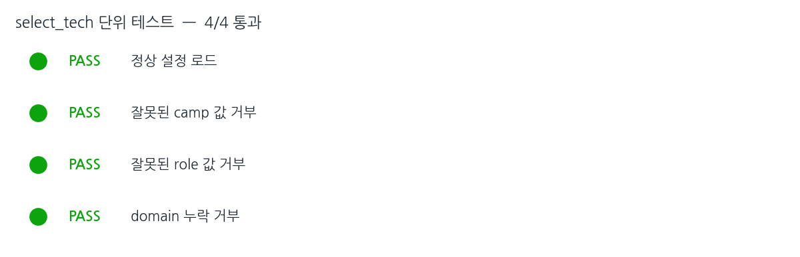
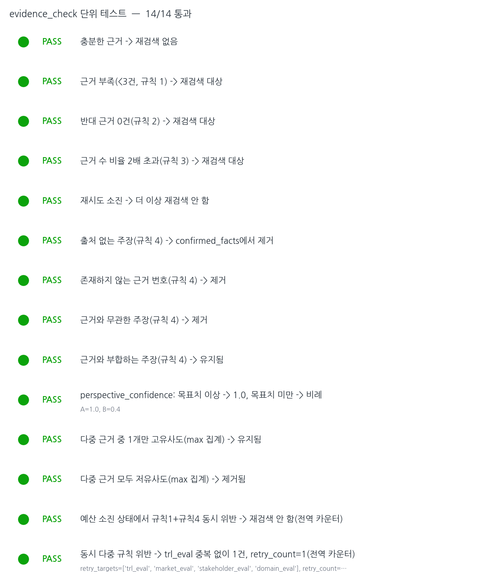

### 4.3 생성 평가 에이전트 (`market_eval` / `stakeholder_eval` / `synthesize`)

설계 의도: `market_eval`/`stakeholder_eval`은 시장 규모·이해관계자 반응이 논문이
아니라 시장 리포트·산업 기사에 있어 RAG 대신 웹 검색만 사용하고, 두 기술에 동일
질의 템플릿을 같은 횟수로 적용해 중립성을 확보함(7.5·7.6절, 10장). `synthesize`는
관점 4종의 근거 신뢰도(`perspective_confidence`)를 코드로 결정론적으로 집계해
LLM에 참고자료로만 제공하되, 기술 간 우열 판단에는 못 쓰게 프롬프트로 통제함(7.8절).

| 에이전트 | 검증 결과 |
|---|---|
| `market_eval` | 8.2 루브릭(TurboQuant 4/5/4/4, ITME 5/5/5/5) + 9.2절 필수 항목 커버리지(둘 다 1.00) |
| `stakeholder_eval` | 8.2 루브릭(TurboQuant·ITME 전부 5/5/5/5) + 9.3절 필수 항목 커버리지(둘 다 1.00) |
| `synthesize` | 8.2 루브릭 4항목 전부 5점 |

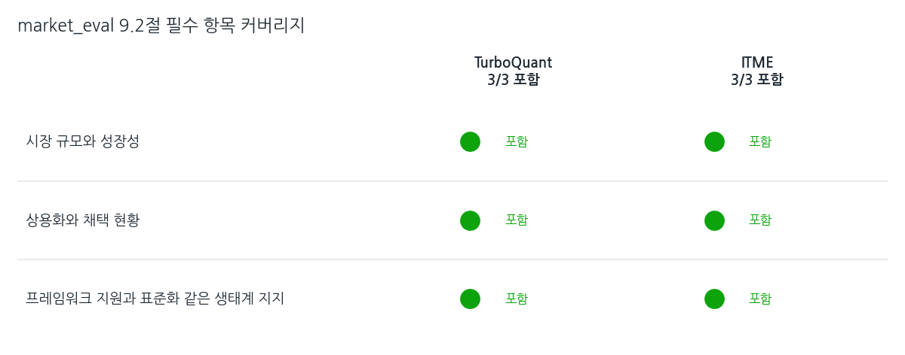
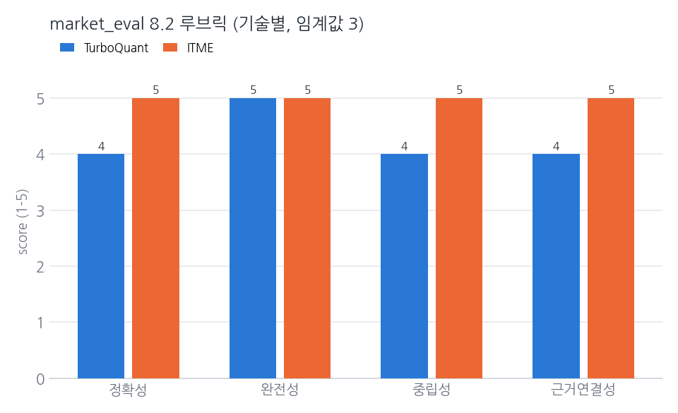

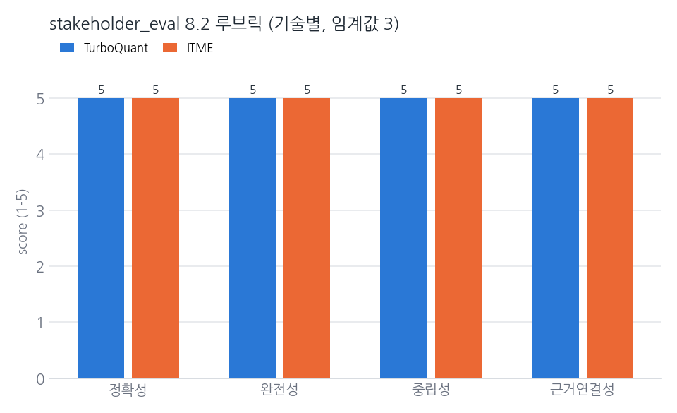
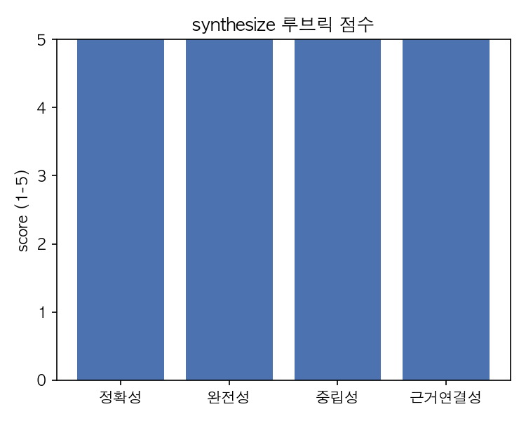

### 4.4 검수·보고서 에이전트 (`judge` / `report`)

설계 의도: `judge`는 생성 모델(GPT)과 다른 계열 모델(Qwen3-8B)을 써서 자기 선호
편향을 구조적으로 피하고, 판정을 이진값(우열 표현/근거 없는 문장/불균형)으로
단순화해 8B급 모델에서도 결과가 안정되게 함(7.9절, 6.3절). `report`는 다듬기
과정에서 존재하지 않는 근거 번호가 섞이지 않도록 인용 안전장치를 두고, 실제로
인용된 근거만 REFERENCE에 남기도록 필터링함(7.10절).

| 에이전트 | 검증 결과 |
|---|---|
| `judge` | 순수함수(`judge_passed`) 4건 + Qwen3-8B 스팟체크 6건 전부 PASS |
| `report` | 인용 안전장치·챕터 직렬화·REFERENCE 표기·JSON/PDF 단위 테스트 전부 PASS |

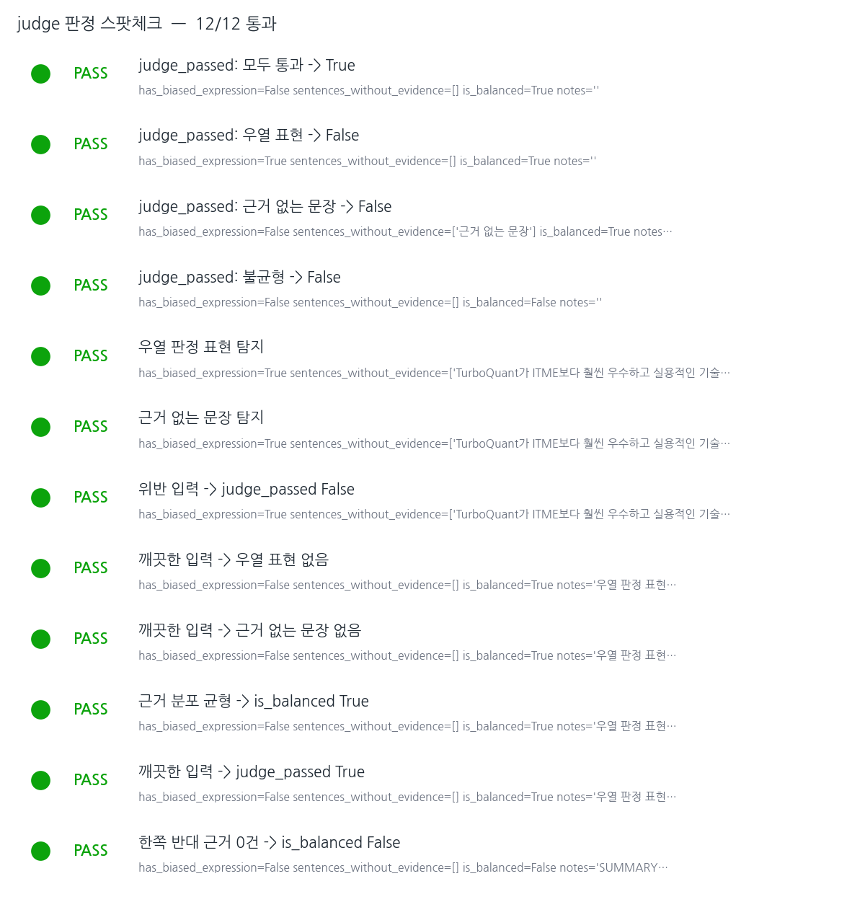
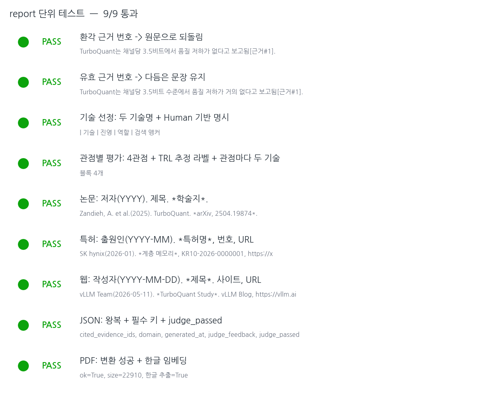

---

## 5. 개발 환경 설정

### 5.1 기본 설치

```bash
python3 -m venv .venv
source .venv/bin/activate
pip install -r requirements.txt

cp .env.example .env
# .env에 OPENAI_API_KEY, TAVILY_API_KEY 채우기
```

임베딩 장치는 `EMBEDDING_DEVICE=auto`(기본)면 cuda → mps(Apple Silicon) → cpu 순으로
자동 선택함. fp16 로드는 CUDA에서만 켜지고 MPS/CPU는 fp32로 동작함.

### 5.2 Ollama 설치 및 실행 (검수 모델 Qwen3-8B, 6.3절)

`judge`, `synthesize`, `market_eval`, `stakeholder_eval`, `report` 2부를 돌리려면
로컬에 Ollama가 떠 있어야 함.

```bash
# 1. 설치
brew install ollama          # macOS
# Linux: curl -fsSL https://ollama.com/install.sh | sh
# Windows: https://ollama.com/download 에서 설치 프로그램 받기

# 2. 서버 실행 (macOS는 앱으로 설치하면 자동 실행됨. 터미널에서 직접 띄우려면:)
ollama serve &

# 3. 검수 모델 다운로드 (4비트 양자화, 약 5GB, 6.3절)
ollama pull qwen3:8b

# 4. 확인
ollama list                       # qwen3:8b가 보여야 함
curl http://localhost:11434       # "Ollama is running" 응답 확인
```

`.env`의 `OLLAMA_BASE_URL`(기본 `http://localhost:11434`)과 `OLLAMA_JUDGE_MODEL`
(기본 `qwen3:8b`)이 위 설정과 일치해야 함. 포트를 바꿨거나 원격 Ollama를 쓰면
`OLLAMA_BASE_URL`을 그에 맞게 고칠 것.

### 5.3 Doc Pool 준비 (RAG 3종에만 필요)

`data/doc_pool/`에 아래 파일명으로 PDF 6편을 받아 둠(`src/common/doc_pool.py`의
arXiv ID 참고, 예: `https://arxiv.org/pdf/2504.19874` → `TurboQuant.pdf`).

| 파일명 | 기술 | arXiv |
|---|---|---|
| `TurboQuant.pdf` | TurboQuant | 2504.19874 |
| `CXL-based.pdf` | ITME | 2606.12556 |
| `DeepSeek-V2.pdf` | DeepSeek-V2 | 2405.04434 |
| `KIVI.pdf` | KIVI | 2402.02750 |
| `Dynamic KV Cache Mgmt.pdf` | InfiniGen | 2406.19707 |
| `PIM-CXL.pdf` | PIM/CXL | 2511.00321 |

파일명은 `src/common/doc_pool.py`의 `DOC_POOL_SPECS`에 고정돼 있음(코드가 그 이름을
그대로 찾음) — 다른 이름으로 받았다면 이 표대로 리네임하거나 `doc_pool.py`를 맞춰 고칠 것.

### 5.4 Golden Dataset 생성 (최초 1회, 팀 공용, RAG 3종에만 필요)

```bash
python -m eval.generate_golden_dataset
```

`eval/golden/golden_dataset.json`을 생성해 git에 커밋함. 팀원 전원이 같은 질의셋으로
비교실험을 해야 결과가 비교 가능하므로, 이미 파일이 있으면 임의로 재생성하지 말 것.

---

## 6. 실행 방법

### 6.1 에이전트별 개별 테스트 (팀원이 각자, 독립적으로)

**규칙 기반, TODO 없이 이미 완성됨 — 지금 바로 실행**:

```bash
python -m scripts.select_tech.test_runner
python -m scripts.evidence_check.test_runner
```

**LLM 호출까지 이미 구현됨 — API 키만 있으면 지금 실행 가능** (프롬프트 초안
단계라 점수가 낮게 나올 수 있음. 그건 실패가 아니라 "고쳐서 재실행"의 시작점):

```bash
python -m scripts.report.test_runner       # 1부(직렬화·REFERENCE·JSON·PDF)는 키 없이 실행, 2부는 OpenAI+Ollama 필요
python -m scripts.synthesize.test_runner   # OpenAI+Ollama 필요
python -m scripts.judge.test_runner        # 1부(judge_passed)는 키 없이 실행, 2부 스팟체크는 Ollama 필요
python -m scripts.tech_research.test_runner   # OpenAI API 키 + Doc Pool PDF + golden_dataset.json 필요
python -m scripts.trl_eval.test_runner
python -m scripts.domain_eval.test_runner
python -m scripts.market_eval.test_runner       # OpenAI+Tavily+Ollama 필요 (8.2 루브릭 + 9.2절 커버리지 + 8.3 Tool Calling Accuracy)
python -m scripts.stakeholder_eval.test_runner  # OpenAI+Tavily+Ollama 필요 (8.2 루브릭 + 9.3절 커버리지 + 8.3 Tool Calling Accuracy)
```

RAG 3종의 `test_runner.py`는:

1. `scripts/{agent}/pdf/v1/index`(절 인식 청킹)와 `v2/index`(naive 슬라이싱)에
   FAISS 색인을 만들거나(최초 1회) 재사용함
2. `v1` 청킹 위에서 임베딩 후보(bge-m3/multilingual-e5-large/Qwen3-Embedding-0.6B)를
   비교함
3. Query Rewriting 적용 전/후를 비교함
4. `report_assets/*.png` 막대그래프와 `{agent}_report.md`를 저장함(둘 다 git 추적함 —
   팀원끼리 결과를 비교·공유하려고 커밋 대상으로 둠. 실행할 때마다 값이 바뀔 수
   있으니, 재실행 후에는 바뀐 리포트를 다시 커밋해서 최신 상태로 유지할 것)

모든 `test_runner.py`는 자신의 `scripts/{agent}/` 아래에만 쓰기 때문에 10개를 동시에
실행해도 서로 영향 없음.

### 6.2 통합 실행

```bash
python -m src.graph
```

`src/graph.py`가 Doc Pool 색인을 `data/doc_pool_index/`에 한 번 만들어 RAG 3종이
공유하게 하고(`.env`의 `DOC_POOL_INDEX_DIR`로 변경 가능, gitignore), 10개 노드를 12장
순서로 실행한 뒤 `output/report.md`를 쓰고 8.3절 Loop Efficiency 원자료(`retry_count`,
`rewrite_count`, 관점·기술별 지지/반대 근거 수, `judge_feedback`)를 JSON으로 출력함.
OpenAI·Tavily 키, Ollama(qwen3:8b), Doc Pool PDF 6편이 모두 필요함.

그래프 흐름만 확인하고 싶으면 `build_graph(nodes)`에 실제 에이전트 대신 같은 계약
(`state -> dict`)의 stub을 넣으면 됨 — API 키·PDF 없이 병렬 분기, 부분 재검색, 재작성
루프가 12장대로 도는지 검증할 수 있음.

---

## 7. 다음 단계

10개 에이전트 구현과 Graph 연결은 끝남. 남은 건 품질 다듬기와 실측:

- 프롬프트 튜닝 계속 — 루브릭·커버리지 점수가 임계값에 걸리면 schedule.md 1절
  루프(만든다 → 돌린다 → 채점 → 프롬프트 수정 → 재실행)대로 담당자가 개선
- `python -m src.graph`로 통합 실행을 여러 번 돌려 8.3절 Loop Efficiency(재검색·
  재작성이 실제로 결과를 개선하는지, 예산 안에서 얼마나 자주 소진되는지) 실측치 축적
- `market_eval`/`stakeholder_eval`이 evidence_check 규칙(반대 근거 0건 등)에 걸려
  재검색되는 빈도 관찰 — Tavily 검색 결과 변동성 때문일 수 있어 재현되는지 확인

---

## 8. 알려진 한계와 설계 결정 근거

리뷰에서 나온 지적 3가지를 어디까지 반영했고, 왜 지금 이대로 뒀는지 정리함.

| 지적 | 현재 상태 | 왜 지금 이대로 뒀는지 |
|---|---|---|
| Query Rewriting 효과를 실측 데이터로 검증할 필요 | 골든셋 30개로 3개 RAG 에이전트 전부 실측 완료(2.2절) | 3개 중 2개는 원본이 낫고 1개(`trl_eval`)만 리라이팅이 나음. "왜 trl_eval만 다른가"는 표본(에이전트당 9~14개 질의)이 작아 추가 조사보다 우선순위가 낮다고 판단해 보류함 |
| 재검색 초점 전환 트리거를 세분화할 필요 | evidence_check의 3개 규칙(근거 3건 미만/반대 근거 0건/비율 2배 초과) 중 무엇이 걸렸든 항상 같은 초점("한계·실패 사례")으로 전환(7.3·7.4절) | 트리거별로 다른 초점을 주는 게 나을 수 있으나, 지금 방식이 실제로 비효율적인지부터 8.3절 Loop Efficiency 데이터로 확인이 먼저라고 판단함(7장 "다음 단계" 참고). 데이터 없이 복잡도만 올리지 않기로 함 |
| evidence_check 임계값(근거 3건, 비율 2배)의 데이터 기반 검증 필요 | 명시적 휴리스틱(schedule.md 4절에 이미 문서화) | 관점당 목표 근거 수를 5~8건으로 잡고 최소 하한을 3건, 지지·반대가 쏠리기 시작하는 지점을 2배로 본 경험적 판단임. 비교실험 비용 대비 효과가 낮다고 보아 처음부터 실험 대상에서 제외했고, 실제 그래프 실행에서 재검색이 비정상적으로 자주/거의 안 걸리는 게 관찰되면 그때 재검토하기로 함 |

## 9. Contributors

| 이름 | 역할 |
|---|---|
| 신소영 | RAG 파이프라인 설계(청크 분할, 메타데이터 스키마), 임베딩 모델 선정 / PDF 로딩·분할 파이프라인, FAISS 색인 구축, 검색 평가 스크립트(Hit Rate@5, MRR) 구현 |
| 최광원 | 생성·검수 LLM 모델 선정, 프롬프트 템플릿 설계 / OpenAI API 연동, Ollama 검수 모델 서빙, 생성·검수 모델 비교 벤치마크, 프롬프트 템플릿 코드화 |
| 문관록 | 시장 평가 에이전트 설계, 웹 검색 도구 인터페이스 설계 / Tavily 웹 검색 도구 구현, `market_eval` 노드 구현 |
| 박기연 | 이해관계자·도메인 평가 에이전트 설계, 대칭 질의 템플릿 설계 / `stakeholder_eval`·`domain_eval` 노드 구현, 대칭 질의 템플릿 코드 적용 |
| 임채현 | State·Graph 아키텍처 설계, 기술 성숙도 에이전트 설계 / State 스키마·LangGraph 그래프 구현, 근거 점검 재시도 로직 구현, `trl_eval` 노드 구현 |
