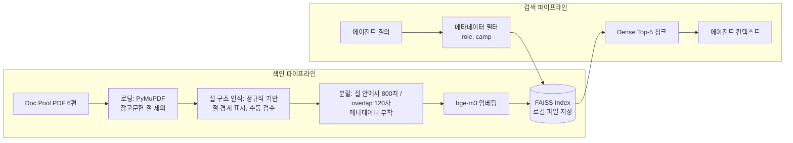
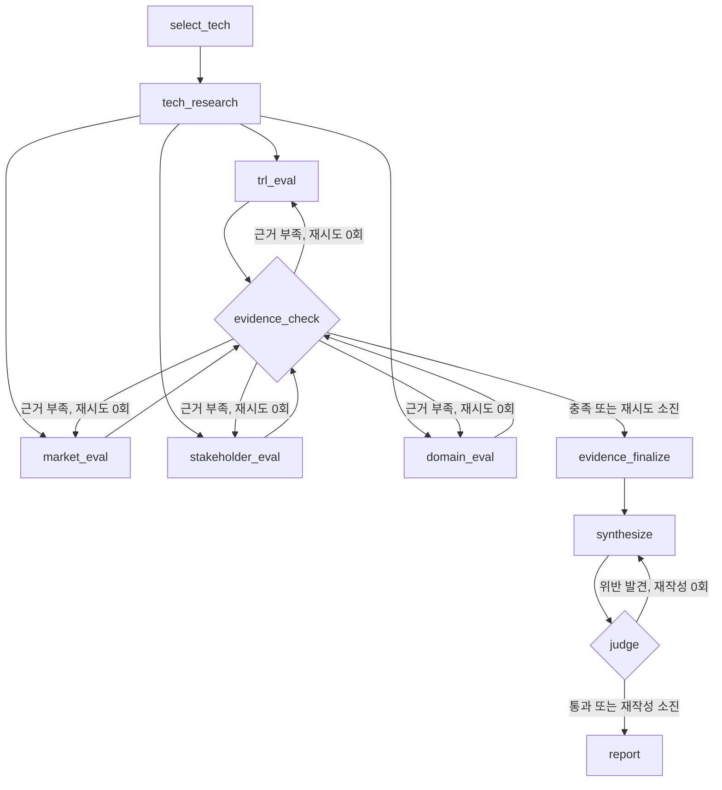

# [판교 7반 1조] KV cache 최적화 기술 다관점 평가 Agentic RAG 설계서

| 캠퍼스, 반 | 조원 |
|---|---|
| 판교_7반_1조 | 박기연(P215), 신소영(P222), 문관록(P214), 최광원(P239), 임채현(P232) |

---

## 목차

- [1. 개요](#sec-1)
- [2. 문제 정의](#sec-2)
- [3. 대상 기술과 선정 사유](#sec-3)
- [4. 에이전트 설계](#sec-4)
- [5. RAG 설계](#sec-5)
- [6. 모델 선정](#sec-6)
  - [6.1 임베딩](#sec-6-1)
  - [6.2 생성 LLM](#sec-6-2)
  - [6.3 검수 LLM](#sec-6-3)
- [7. 에이전트별 모델 및 RAG 상세 설계](#sec-7)
  - [7.1 기술 선정 (select_tech)](#sec-7-1)
  - [7.2 기술 조사 (tech_research)](#sec-7-2)
  - [7.3 기술 성숙도 (trl_eval)](#sec-7-3)
  - [7.4 도메인 평가 (domain_eval)](#sec-7-4)
  - [7.5 시장 평가 (market_eval)](#sec-7-5)
  - [7.6 이해관계자 평가 (stakeholder_eval)](#sec-7-6)
  - [7.7 근거 점검 (evidence_check)](#sec-7-7)
  - [7.8 평가 종합 (synthesize)](#sec-7-8)
  - [7.9 중립성 검수 (judge)](#sec-7-9)
  - [7.10 보고서 생성 (report)](#sec-7-10)
- [8. 공통 RAG 및 에이전트 평가 체계 수립 계획](#sec-8)
  - [8.1 Retrieval 평가 지표](#sec-8-1)
  - [8.2 Generation 평가 지표](#sec-8-2)
  - [8.3 Agent System 평가 지표](#sec-8-3)
  - [8.4 Golden Dataset & 평가 자동화 파이프라인 계획](#sec-8-4)
- [9. 평가 관점과 기준](#sec-9)
  - [9.1 기술 성숙도](#sec-9-1)
  - [9.2 시장성](#sec-9-2)
  - [9.3 이해관계자](#sec-9-3)
  - [9.4 도메인 적용](#sec-9-4)
  - [9.5 종합 의견](#sec-9-5)
- [10. 중립성 확보 방안](#sec-10)
- [11. State 설계](#sec-11)
- [12. Graph 설계](#sec-12)
- [13. 평가 보고서 목차](#sec-13)
- [14. 역할 분담](#sec-14)
- [REFERENCE](#sec-ref)

---

## 1. 개요

KV cache는 LLM이 앞서 계산한 Key와 Value를 재사용하게 해 주는 장치이지만, 문맥이 길어질수록 가속기 메모리를 빠르게 소진함(Kwon et al., 2023). 이 병목을 두고 데이터를 줄이려는 SW 진영과 담을 공간을 넓히려는 HW 진영이 서로 다른 해법을 내놓고 있음.

본 설계의 대상은 두 진영에서 기술을 하나씩 골라 논문과 웹의 공개 정보를 수집하고, 기술 성숙도, 시장성, 이해관계자, 도메인 적용의 네 관점에서 비교한 평가 보고서를 자동으로 생성하는 LangGraph 기반 Multi-Agent 시스템임. 보고서는 어느 기술이 나은지를 가리지 않고, 같은 기술이 관점에 따라 어떻게 다르게 평가되는지를 보여 주는 데 목적을 둠.

| 항목 | 설계 결정 |
|---|---|
| 비교 기술 | SW 진영 TurboQuant, HW 진영 ITME |
| 평가 도메인 | 에이전트형 AI 코딩 서비스의 멀티턴 장문맥 서빙 |
| 구조 | 에이전트 10개, 관점 평가 4개는 병렬 실행 |
| RAG | 기술 조사, 기술 성숙도, 도메인 적용 에이전트에 적용. Doc Pool 6편 136쪽 |
| 모델 | 생성 OpenAI GPT-5 mini(API), 검수 Qwen3-8B(로컬, 오픈소스), 임베딩 bge-m3(로컬, 오픈소스) |
| 외부 검색 | Tavily 웹 검색 |

---

## 2. 문제 정의

평가 도메인은 에이전트형 AI 코딩 서비스의 멀티턴 장문맥 서빙으로 정함. 코딩 에이전트는 코드베이스와 도구 정의가 담긴 긴 공통 문맥 위에서 짧은 후속 요청을 수십 턴 이어 가고, 도구를 실행하는 동안에는 세션이 멈춰 있음. vLLM 팀이 공개한 실제 에이전트 트래픽 분석에서는 세션당 턴 수의 중앙값이 43, 입력 길이의 중앙값이 142K 토큰인 반면 출력은 444 토큰이었고, prefix cache 적중률은 96%를 넘었음(vLLM Team, 2026). 같은 문맥을 매 턴 다시 계산하지 않으려면 KV cache를 세션이 끝날 때까지 보관해야 하므로, 캐시를 얼마나 작게 만들 수 있는지와 어디에 싸게 둘 수 있는지가 서비스 원가로 직결됨. 서비스 사업자가 캐시된 입력 토큰에 큰 폭의 할인 요금을 적용하는 것도 이 재사용의 가치가 가격에 드러난 사례임. Anthropic은 캐시에서 읽은 입력 토큰에 기본 입력 단가의 0.1배를 적용함(Anthropic, 2026).

데이터센터 서빙 전반이 아니라 이 워크로드로 좁힌 이유는 두 가지임. ITME 논문이 에이전트형, 장문맥 워크로드의 확산을 문제의 출발점으로 삼고 prefix cache의 예측 가능한 접근 패턴을 핵심 근거로 쓰고 있어 도메인과 기술이 직접 맞닿음(Jang et al., 2026). 또한 누가 이득을 보고 누가 부담을 지는지가 분명해 이해관계자 관점을 구체적으로 다룰 수 있음. 온디바이스 환경은 CXL 계열 기술이 해당되지 않아 비교가 성립하지 않으므로 제외함.

이 도메인에서 시스템이 답해야 할 질문은 세 가지임.

1. 각 기술은 지금 어느 단계까지 와 있으며, 공개 정보만으로 어디까지 확인되는가
2. 시장과 이해관계자는 각 기술을 어떻게 받아들였고, 시각이 갈리는 지점은 어디인가
3. 에이전트 코딩 서비스의 멀티턴 서빙에 도입하려면 각 기술은 무엇을 요구하고 어떤 장벽이 있는가

조사는 논문, 기사, 제조사 발표 자료 같은 공개 정보에 한정함. 기술을 직접 구현하거나 성능을 재현하지 않으며, 우열 판정과 도입 추천도 하지 않음.

---

## 3. 대상 기술과 선정 사유

기술 선정은 조가 직접 수행함(Human 기반). 선정 결과는 설정 파일에 두고, 그래프의 첫 노드가 이를 읽어 State에 올림.

### TurboQuant (SW)

입력 벡터를 무작위 회전시켜 좌표 분포를 고르게 만든 뒤 좌표별 스칼라 양자화를 적용하는 방식임. 보정 데이터가 필요 없고 토큰이 들어오는 즉시 양자화할 수 있어 KV cache에 맞음. 논문은 채널당 3.5비트에서 품질 저하가 없고 2.5비트에서 저하가 미미하다고 보고함(Zandieh et al., 2025).

> arxiv.org: https://arxiv.org/pdf/2504.19874

### ITME (HW)

SK hynix가 제안한 계층 메모리 구조로, CXL-Hybrid 메모리를 TB 규모의 바이트 주소 지정 가능한 원격 메모리로 제공함. 모델 가중치와 prefix cache의 접근 패턴이 예측 가능하다는 점을 이용해 CXL 메모리에서 GPU 메모리로 데이터를 미리 옮김. 양산급 CMM 제품과 PCIe Gen5 NVMe SSD로 성능을 평가하고 FPGA 시제품으로 동작을 확인함(Jang et al., 2026).

> arxiv.org: https://arxiv.org/pdf/2606.12556

### 선정 이유

두 기술을 고른 이유는 세 가지임.

1. **진영의 발상을 가장 선명하게 대표함.** TurboQuant는 기존 하드웨어를 그대로 두고 데이터만 줄이며, ITME는 데이터를 그대로 두고 담을 곳을 넓힘.
2. **성숙 단계가 뚜렷하게 다름.** 하나는 소프트웨어만으로 적용할 수 있고 다른 하나는 새 인프라가 필요해, 기술 성숙도 관점에서 대비가 분명함.
3. **네 관점 모두에서 확인할 공개 자료가 있음.** TurboQuant는 공개 당일 메모리 관련 종목이 3~6% 하락했고, 메모리 수요를 줄일 것이라는 해석과 과도한 반응이라는 해석이 함께 나왔음(Stan, 2026). vLLM에 통합된 뒤 나온 독립 검증은 4비트 설정에서 1~4점의 정확도 저하를, 3비트 설정에서는 수학과 코딩 벤치마크에서 최대 20점의 저하를 보고해 논문의 주장과 온도 차가 있음(Kurtić et al., 2026). ITME는 메모리 업계의 기업이 내놓은 해법이어서 이해관계자 관점에서 두 기술이 서로 맞물림.

### 미선정 사유

| 기술 | 사유 |
|---|---|
| DeepSeek-V2 (MLA) | 모델 구조 자체를 바꾸는 방식이라, 이미 학습된 모델에 사후 적용하는 기술과 비교 축이 다름 |
| KIVI | 양자화 계열의 기준선 연구로, 시장과 이해관계자 관점에서 확인할 자료가 적음 |
| InfiniGen | 호스트 메모리 오프로딩 연구로, 제품 채택 사례를 찾기 어려움 |
| PIM/CXL | ITME와 같은 CXL 축이며, 제품화 관련 공개 자료가 ITME보다 적음 |

미선정 4편도 RAG 색인에는 포함함. 선정 기술이 같은 진영의 다른 방식과 무엇이 다른지 답하려면 비교 대상의 원문이 필요하기 때문임.

---

## 4. 에이전트 설계

에이전트는 책임 단위로 10개를 분리해 설계함. 관점 평가는 기술 성숙도, 시장성, 이해관계자, 도메인 적용 네 개로 나누되, 기술 성숙도는 TRL 구간 추정이라는 판단 기준 자체가 다른 세 관점(시장성, 이해관계자, 도메인 적용)과 성격이 달라 별도 에이전트로 분리함.

근거 점검과 중립성 검수도 관점 평가와 책임의 층위가 달라 각각 독립된 에이전트로 분리함. 근거 점검은 수집된 사실의 충분성과 지지·반대 균형을 보는 자료 단계의 점검이고, 중립성 검수는 종합된 서술의 표현과 어조를 보는 산출물 단계의 검수임.

시장 평가는 시장 규모, 채택 현황처럼 답이 논문 원문이 아니라 시장 리포트와 산업 기사에 있는 정보라 RAG 대상에서 제외하고 웹 검색만 쓰도록 설계함.

| 에이전트 | 책임 | 도구 | RAG | 입력 | 출력 |
|---|---|---|---|---|---|
| 기술 선정 `select_tech` | 선정 기술과 도메인을 설정에서 읽어 옴 | 없음 | X | 설정 파일 | `techs`, `domain` |
| 기술 조사 `tech_research` | 논문에서 기술 개요, 적용 범위, 한계, 같은 진영 다른 방식과의 차이를 추출 | 논문 검색 | O | `techs` | `tech_profiles` |
| 기술 성숙도 `trl_eval` | TRL 구간을 추정하고 근거와 정보 공백을 정리 | 논문 검색, 웹 검색 | O | `tech_profiles` | `trl_result` |
| 시장 평가 `market_eval` | 시장 규모와 성장성, 채택 현황, 생태계 지지를 조사 | 웹 검색 | X | `tech_profiles`, `techs` | `market_result` |
| 이해관계자 평가 `stakeholder_eval` | 경쟁 진영, 도입 기업과 개발자, 투자 업계의 반응을 조사 | 웹 검색 | X | `tech_profiles`, `techs` | `stakeholder_result` |
| 도메인 평가 `domain_eval` | 에이전트 코딩 서비스의 멀티턴 장문맥 서빙에 도입할 때의 조건과 장벽을 정리 | 논문 검색, 웹 검색 | O | `tech_profiles`, `domain` | `domain_result` |
| 근거 점검 `evidence_check` | 관점별 근거 수, 반대 근거 유무, 기술 간 균형을 점검하고 부족한 관점을 재검색 대상으로 지정 | 없음 | X | 관점 결과 4종, `evidence` | `retry_targets`, `retry_count` |
| 평가 종합 `synthesize` | 관점 사이의 일치와 상충을 정리 | 없음 | X | 관점 결과 4종 | `synthesis` |
| 중립성 검수 `judge` | 우열 판정 표현, 출처 없는 문장, 기술 간 서술 불균형을 검사 | 없음 | X | `synthesis`, `evidence` | `judge_feedback` |
| 보고서 생성 `report` | 목차에 맞춰 보고서를 조립하고 PDF로 변환 | 없음 | X | State 전체 | `report_md`, `report_path` |

조사와 관점 에이전트는 공통으로 `evidence`와 `references`에도 기록함.

### 공통 도구

에이전트가 쓰는 도구는 세 가지임.

| 도구 | 기능 | 입력 | 출력 |
|---|---|---|---|
| `paper_search` | Doc Pool 색인에서 관련 청크를 검색 | 질의, 메타데이터 필터(기술, 진영, 역할), k | 청크 본문과 문서명, 절, 쪽 |
| `web_search` | Tavily로 기사, 발표 자료, 시장 리포트를 검색 | 질의, 기간, 결과 수 | 제목, URL, 게시일, 본문 발췌 |
| `summarize_sources` | 검색 결과를 주장 단위로 요약하고 출처를 붙임 | 검색 결과 목록, 관점, 기술명 | 근거 목록(주장, 지지 또는 반대, 출처) |

도구 선택을 모델에 맡기면 실행마다 호출 경로가 달라져 두 기술에 같은 질의를 적용한다는 원칙이 깨지므로, 어떤 도구를 어떤 질의로 부를지는 에이전트 코드에서 정하고 모델은 요약과 판단에만 씀. RAG 에이전트 3종(7.2~7.4)이 검색 직전에 적용하는 Pre-retrieval Query Rewriting은 예외가 아니라 이 원칙 위에서 동작함: 코드가 고정한 질의를 두 기술 모두 같은 지시문으로 다듬을 뿐, 어떤 도구를 부를지나 무엇을 검색할지는 여전히 코드가 정함.

---

## 5. RAG 설계

RAG는 답이 논문 원문에 있는 질문을 맡는 에이전트에만 적용함. 기술의 구조와 한계, 실험 조건, 요구되는 하드웨어는 논문에 있으므로 기술 조사, 기술 성숙도, 도메인 평가가 대상임. 시장 규모나 업계 반응은 논문에 없으므로 시장 평가와 이해관계자 평가는 웹 검색으로 처리함.

| 문서 | 진영 | 역할 | 쪽수 |
|---|---|---|---|
| TurboQuant | SW | 평가 대상 | 25 |
| ITME | HW | 평가 대상 | 13 |
| DeepSeek-V2 | SW | 비교 근거 | 52 |
| KIVI | SW | 비교 근거 | 15 |
| InfiniGen | HW | 비교 근거 | 18 |
| PIM/CXL | HW | 비교 근거 | 13 |
| **합계** | | | **136** |

Doc Pool 6편을 모두 색인하며 합계 136쪽으로 200쪽 한도 안에 있음. 평가 대상 2편만 넣으면 검색 공간이 좁아 검색 품질을 따질 의미가 없고, 같은 진영의 다른 방식과 비교하는 질문에 답할 수 없음.

### 단계 설계

| 단계 | 설계 |
|---|---|
| 로딩 | PyMuPDF로 쪽 단위 추출. 참고문헌 절은 색인에서 제외 |
| 절 구조 인식 | 정규식으로 절 제목 패턴(숫자와 마침표로 시작하는 제목, Abstract, Introduction, Related Work 등 관용적 표제어)을 찾아 절 경계를 먼저 표시함. 문서 6편 규모이므로 탐지 결과는 색인 전에 수동으로 검수함 |
| 분할 | 절 경계 안에서만 RecursiveCharacterTextSplitter로 800자, overlap 120자 분할(절 우선 분리 후 하위 분할하는 2단계 방식) |
| 메타데이터 | `tech`, `camp`(SW, HW), `role`(target, comparison), `section`(절 구조 인식 단계에서 부여), `page` |
| 임베딩 | bge-m3, 로컬 실행. 선정 근거는 6.1절 |
| 저장 | FAISS, 로컬 파일로 저장해 재실행 시 색인을 다시 만들지 않음 |
| 검색 | 메타데이터 필터를 먼저 걸고 Dense Top-5. 기술 개요 질의는 `role=target`, 비교 질의는 같은 `camp` 전체로 범위를 조절 |

절 경계를 먼저 잡지 않고 쪽 텍스트를 바로 800자로 슬라이싱하면, 한 청크가 두 절에 걸치거나 직전 절 제목이 다음 절의 청크에도 그대로 상속되는 문제가 생김. 절을 먼저 나누고 그 안에서만 분할하면 청크 하나가 절 경계를 넘지 않아 `section` 메타데이터가 항상 정확한 값을 가짐.

검색 품질은 직접 만든 평가셋으로 확인함. 논문 내용을 묻는 한국어 질의 30개에 정답 청크를 표시해 두고 Hit Rate@5와 MRR을 계산함. 같은 평가셋을 임베딩 후보 비교에도 씀. (측정 방식의 구체적 설계는 [8장 평가 체계](#sec-8)에서 확장함.)

---

## 6. 모델 선정

임베딩은 과제 조건에 따라 오픈소스 모델을 로컬에서 실행하고, 생성은 상용 API, 검수는 로컬 오픈소스 모델로 나눔. 로컬 실행 환경은 통합 메모리 16GB의 노트북 한 대임. 후보는 이 조건에서 걸러 냈고, 공개 리더보드 순위는 기준으로 삼지 않음. 리더보드 점수는 여러 과제와 언어에 걸친 평균이어서(Muennighoff et al., 2023), 한국어 질의로 영어 논문을 찾는 교차 언어 검색이라는 본 과제의 조건에서 어떤 모델이 나은지를 직접 말해 주지 않기 때문임.

### 6.1 임베딩

필요한 조건은 네 가지임. 질의는 한국어이고 문서는 영어이므로 교차 언어 검색이 되어야 함. 800자 청크에 수식과 표가 섞여 토큰 수가 늘어나도 잘리지 않아야 함. LLM과 함께 메모리에 올라가야 하므로 1B 미만이어야 함. 라이선스에 제약이 없어야 함.

| 후보 | 다국어 | 최대 입력 | 파라미터 | 라이선스 |
|---|---|---|---|---|
| BAAI/bge-m3 | 100개 이상 언어 | 8,192 토큰 | 약 5.7억 | MIT |
| intfloat/multilingual-e5-large | 지원 | 512 토큰 | 5.6억 | MIT |
| Qwen/Qwen3-Embedding-0.6B | 지원 | 32K 토큰 | 6.0억 | Apache 2.0 |

bge-m3를 선택함. multilingual-e5-large는 입력이 512 토큰으로 제한되어, 수식이 많은 청크가 잘릴 위험이 있음. Qwen3-Embedding은 질의에 지시문을 붙여야 제 성능이 나오는 방식이라 관점마다 질의 형식이 다른 본 시스템에서는 관리할 변수가 하나 더 생김. bge-m3는 질의와 문서를 같은 방식으로 임베딩하고, Dense 벡터와 Sparse 가중치를 한 모델에서 함께 얻을 수 있어 이후 Hybrid 검색으로 넓히기 쉬움.

적용 방식은 다음과 같음. 벡터는 정규화해 내적으로 유사도를 계산함. 색인은 한 번 만든 뒤 파일로 저장해 재사용함. 구현 단계에서 5장의 평가셋으로 세 후보의 Hit Rate@5와 MRR을 측정하고, bge-m3가 다른 후보보다 뚜렷이 낮으면 교체함.

### 6.2 생성 LLM

생성에는 OpenAI API의 GPT-5 mini를 씀. 선택 기준은 세 가지임.

| 기준 | 필요한 이유 | 판단 |
|---|---|---|
| 출력 형식 보장 | 모든 에이전트가 정해진 스키마의 JSON으로 결과를 돌려주므로, 형식을 어기면 그래프가 멈춤 | Structured Outputs의 strict 모드는 응답이 JSON 스키마를 따르도록 디코딩 단계에서 제한함(OpenAI, 2024). 프롬프트로 부탁하는 방식보다 확실함 |
| 병렬 처리 | 관점 평가 4개가 동시에 LLM을 호출함 | 로컬 8B 모델은 한 번에 한 요청만 처리해 병렬 구조의 이점이 사라짐. API는 4개 요청을 동시에 받음 |
| 문맥 길이와 한국어 | 관점마다 검색 결과 5건과 웹 자료를 함께 넣고, 최종 산출물이 한국어 보고서임 | 로컬 환경의 실질 상한인 16K를 넘는 입력을 받을 수 있고 한국어 문장 품질이 안정적임 |

같은 계열의 상위 모델을 쓰지 않은 이유는 작업의 성격에 있음. 각 에이전트의 일은 주어진 근거를 스키마에 맞춰 정리하는 것이어서 긴 추론이 필요하지 않고, 한 번 실행에 LLM 호출이 10회 이상 일어나므로 응답 시간과 비용이 작은 쪽이 맞음. 재현성을 위해 모델 이름은 설정 파일에 고정하고, API 응답은 실행 단위로 캐시에 저장함.

### 6.3 검수 LLM

검수에는 생성 모델과 계열이 다른 오픈소스 모델 Qwen3-8B를 Ollama로 로컬 실행해 씀. 같은 모델이 자기 출력을 검수하면 자기 문장을 후하게 평가하는 자기 선호 편향이 생긴다는 점이 알려져 있음(Zheng et al., 2023; Panickssery et al., 2024). 제공사와 학습 데이터가 다른 모델을 두면 이 편향을 구조적으로 피할 수 있음. 검수는 점수를 매기지 않고, 우열 판정 표현이 있는가, 출처 없는 문장이 있는가, 두 기술의 분량과 어조가 균형을 이루는가를 예, 아니오로 답하게 함. 판단을 단순하게 두면 작은 모델에서도 결과가 안정됨.

로컬 모델 선택에서 가장 먼저 걸리는 제약은 메모리임. 16GB에서 운영체제와 임베딩 모델을 빼면 LLM이 쓸 수 있는 몫은 8~9GB 정도이고, 이 안에 가중치와 KV cache가 함께 들어가야 함. Qwen3-8B는 36개 층, KV 헤드 8개, 헤드 차원 128이어서(Qwen Team, 2025) FP16 기준 토큰당 KV cache가 약 0.14MB이고, 문맥 16K에서 2.25GB, 32K에서 4.5GB를 차지함. 4비트 가중치 약 5GB와 합치면 16K 문맥이 이 환경의 실질적 상한임. 문맥을 늘리려면 모델을 줄여야 하는 이 맞교환이 본 과제가 다루는 KV cache 병목과 같은 문제임. 검수 입력은 보고서 초안 한 편이므로 16K 안에 들어옴.

| 후보 | 파라미터 | 라이선스 | 판단 |
|---|---|---|---|
| **Qwen3-8B** | 82억 | Apache 2.0 | **선택.** 4비트에서 약 5GB로 예산에 들어오고, JSON 출력을 공식 지원하며 한국어를 포함한 다국어로 학습되어 한국어 보고서를 읽고 판단할 수 있음 |
| Llama-3.1-8B-Instruct | 80억 | Llama 3.1 Community | 크기는 맞으나 공식 지원 언어 8개에 한국어가 없어(Meta, 2024) 한국어 보고서 검수에는 맞지 않음 |
| EXAONE-3.5-7.8B | 78억 | EXAONE 전용 | 한국어 강점이 있으나 연구 목적 전용 라이선스로 상업적 이용이 금지되어 있어(LG AI Research, 2024), 기업 교육 과정의 산출물에 쓰기에는 용도 해석의 여지가 남음 |
| Gemma-3-12B | 122억 | Gemma 약관 | 4비트에서 약 8GB로 예산 경계에 걸려 문맥을 8K 아래로 줄여야 함 |
| gpt-oss-20b | 209억 | Apache 2.0 | 생성 모델과 같은 제공사여서 계열 분리 목적에 맞지 않고, 가중치만으로 예산을 넘음 |

구현 단계에서 GPT-5 mini와 Qwen3-8B에 같은 프롬프트를 10회씩 넣어 스키마 준수율과 평균 응답 시간을 비교하고, 그 결과를 README에 기록함.

---

## 7. 에이전트별 모델 및 RAG 상세 설계

6장에서 정한 임베딩(bge-m3), 생성 LLM(GPT-5 mini), 검수 LLM(Qwen3-8B) 선정과, 4장에서 고정한 10개 에이전트의 이름, 책임, 기본 RAG 조건(메타데이터 사전 필터링, Dense Top-5, 재검색 최대 1회)은 그대로 두고, 각 에이전트가 실제로 이 자원을 어떻게 쓰는지를 설계 수준에서 개별 섹션으로 확장함.

데이터 구조는 Pydantic이나 JSON 같은 구현 문법으로 새로 정의하지 않고, 11장 State 표에 이미 있는 필드명과 타입을 그대로 참조함. 각 에이전트가 State의 어느 필드를 읽고 어느 필드에 쓰는지, 그 값이 어떤 방식으로 채워지는지를 중심으로 기술함.

### 7.1 기술 선정 (`select_tech`)

| 항목 | 내용 |
|---|---|
| 책임 | 선정 기술과 도메인을 설정 파일에서 읽어 State에 올림 |
| 도구 / RAG | 없음 / 미사용 |
| 입력 → 출력 | 설정 파일 → `techs`, `domain` |

**[상세 설계]**

**1. 동작 로직**

설계: LLM을 호출하지 않는 순수 로더 노드로 둠. 설정 파일을 읽어 `techs`와 `domain` 값을 검증한 뒤 State에 그대로 씀. 검증 항목은 필수 필드 존재 여부와 `camp`, `role` 값이 정해진 값 중 하나인지임.

이유: 판단이 필요 없는 결정론적 단계이므로 규칙 기반 코드로 처리함.

**2. 입출력 흐름**

설계: 입력은 설정 파일 하나이고, 출력은 State의 `techs`(TechSpec 목록)와 `domain`(문자열) 두 필드임. 두 값 모두 11장 State 표에 정의된 타입을 그대로 따름. TechSpec에는 기술명, 진영, 역할 같은 기본 정보와 함께, market_eval과 stakeholder_eval이 웹 검색 질의에 쓰는 검색 앵커 키워드(기술을 다른 동음이의어와 구분해 주는 짧은 키워드, 예: ITME는 "SK hynix")도 설정 파일에서 그대로 읽어 담음.

이유: 새로운 데이터 구조를 만들지 않고 State에 이미 정의된 필드에 값을 채우는 역할로 한정해, 이 노드가 하는 일을 설정값을 옮기는 것 하나로 명확히 함.

**3. Context Window & Memory**

설계: 단일 설정 파일 로드이므로 컨텍스트 개념이 없음.

이유: 이후 모든 노드가 `techs`, `domain`을 State에서 직접 참조하므로 재전달 비용이 없음.

**[설계 및 모델 선정 이유]**

- LLM을 쓰지 않는 이유: 기술 선정 자체가 3장에서 밝힌 대로 사람이 이미 결정을 내린 값이고, 이 노드는 그 값을 State 스키마에 맞춰 옮기는 역할만 함. 생성이나 추론이 개입할 지점이 없고, 오히려 LLM을 넣으면 설정값을 환각으로 바꿀 위험만 늘어남.
- 설정 파일 분리 이유: 기술 세트를 코드가 아닌 데이터로 두면, 향후 비교 기술 쌍을 바꿀 때 그래프 코드를 건드리지 않고 재실행할 수 있음.

---

### 7.2 기술 조사 (`tech_research`)

| 항목 | 내용 |
|---|---|
| 책임 | 논문에서 기술 개요, 적용 범위, 한계, 같은 진영 다른 방식과의 차이를 추출 |
| 도구 / RAG | `paper_search` / **사용** |
| 입력 → 출력 | `techs` → `tech_profiles` |
| Document Loader 및 전처리 | PyMuPDF(fitz) 파서, 정규식 기반 절 구조 인식 후 참고문헌 절 제거 |
| Text Splitter (청킹) | 절 경계 안에서 RecursiveCharacterTextSplitter로 800자 / overlap 120자 분할(절 우선 분리 후 하위 분할) |
| Embedding Model | bge-m3, 벡터 정규화 후 내적 유사도 |
| Indexing Strategy | FAISS 완전 탐색(Flat) 인덱스, 근사 인덱스 미사용 |
| RAG 및 재검색 전략 | Pre-retrieval Query Rewriting + `role=target` 사전 필터 + Dense Top-5, 재검색 없음(단일 패스), 정식 reranker 미도입 |
| Context 및 Memory | Top-5 청크(약 4,000자) + 질의, State에는 `TechProfile`만 저장 |

**[상세 설계]**

**1. Document Loader 및 전처리**

설계: 파서는 PyMuPDF(fitz)를 씀. 쪽 단위 텍스트를 뽑은 뒤 정규식으로 절 제목 패턴(숫자와 마침표로 시작하는 제목, Abstract, Introduction, Related Work 등 관용적 표제어)을 찾아 절 경계를 먼저 표시하고, 참고문헌(References) 절은 이 단계에서 제거함.

이유: Doc Pool 6편이 전부 arXiv PDF이고 쪽 번호와 절 구조를 그대로 보존해야 메타데이터(`section`, `page`)를 채울 수 있음. PyMuPDF는 쪽 단위 텍스트 추출과 레이아웃 정보를 함께 제공해 표와 수식이 섞인 논문에서도 문단 순서가 비교적 안정적으로 유지됨. HWP나 Web용 파서는 Doc Pool 전체가 PDF뿐이라 이 단계에서 필요하지 않음. 절 경계를 먼저 잡지 않고 바로 청킹하면 청크 하나가 두 절에 걸치거나 직전 절 제목이 다음 절 청크에도 그대로 상속되어 `section` 메타데이터가 부정확해지므로, 절 인식을 청킹보다 앞에 둠. 참고문헌을 남기면 저자명과 연도 같은 짧고 반복적인 토큰이 임베딩 공간을 오염시켜 본문 검색 정확도를 떨어뜨림.

**2. Text Splitter (청킹)**

설계: RecursiveCharacterTextSplitter를 쓰되, 절 구조 인식 단계에서 표시한 절 경계 안에서만 분할함. chunk_size는 800자, overlap은 120자로 둠. 5장에서 정한 값과 동일하며, 전 에이전트가 하나의 색인을 공유하므로 청킹 정책을 이원화하지 않음.

이유: 논문 문단은 대체로 400~900자 단위로 하나의 주장을 담고 있어 800자면 한 청크에 한 주장이 들어갈 확률이 높음. 절 경계 안에서만 분할하므로 청크의 `section` 값이 항상 정확하게 매겨짐. Semantic Splitter는 기호와 수식이 많은 텍스트에서 문장 경계 판단이 불안정해 제외했고, Markdown Header 기반 분할은 PDF 추출물에 헤더 마크업이 없어 적용할 수 없어 정규식 기반 절 인식으로 대신함. Overlap 120자는 청크 경계에서 문장이 끊겨 문맥을 잃는 것을 막는 최소한의 여유로 잡음.

**3. Embedding Model**

설계: bge-m3를 로컬에서 씀. 벡터는 정규화한 뒤 내적으로 유사도를 계산함.

이유: 8,192 토큰 한도 덕분에 800자 청크는 잘릴 위험이 없음. 질의(한국어)와 문서(영어)를 같은 인코더로 처리하는 교차 언어 검색이 이 에이전트의 핵심 요구 조건이라, 6.1절에서 bge-m3를 선택한 1순위 이유와 정확히 맞물림.

**4. Indexing Strategy**

설계: FAISS의 완전 탐색 인덱스를 쓰고 근사 인덱스는 쓰지 않음. 색인은 최초 1회 구축한 뒤 로컬 파일로 저장해 재사용함.

이유: Doc Pool 136쪽을 800자, overlap 120자 기준으로 나누면 청크 수는 약 300~400개 수준으로 추정됨. HNSW나 IVF 같은 근사 인덱스는 수만에서 수백만 벡터 규모에서 속도와 재현율의 트레이드오프가 의미를 가지는데, 이 규모에서는 완전 탐색도 충분히 빨라 근사 인덱스의 파라미터 튜닝 비용을 들일 이유가 없음.

**5. RAG 및 재검색 전략**

설계: paper_search를 호출하기 전에 **pre-retrieval 단계로 Query Rewriting을 적용함**. 코드가 고정한 질의 템플릿(기술 개요 질의, 비교 질의)의 문구를 그대로 검색에 쓰지 않고, GPT-5 mini의 짧은 텍스트 생성 호출 1회로 논문이 실제로 쓰는 영어 표현에 가깝게 다듬은 뒤 검색함. 리라이팅 이후에는 메타데이터를 `role=target`으로 먼저 걸러 TurboQuant와 ITME 원문에서만 근거를 찾고, Dense Top-5를 가져옴. 같은 진영 다른 방식과의 차이를 묻는 질의에는 `role` 조건을 풀고 같은 `camp` 전체로 필터를 넓힘. 재검색은 두지 않고 단일 패스로 끝냄. 검색 이후 별도의 정식 reranker(cross-encoder 등)는 두지 않고, Dense Top-5를 그대로 컨텍스트로 씀.

이유: 질의(한국어)와 문서(영어) 사이의 표현 격차가 이 시스템의 핵심 난제(6.1절)이므로, 검색 직전에 질의를 논문 표현에 가깝게 다듬으면 임베딩만으로 메우기 어려운 부분을 보완할 수 있음. 리라이팅은 구조화 출력이 아닌 짧은 텍스트 생성 1회로 처리해 비용이 작고, 고정된 지시문으로 두 기술 모두 동일하게 적용해 10장 중립성 원칙(대칭 처리)을 깨지 않음. 리라이팅은 재검색 루프가 아니라 단일 패스 앞에 놓인 전처리 1회이므로, "이 단계에서 결과가 흔들리면 안 된다"는 이 에이전트의 안정성 원칙과도 충돌하지 않음. 기술 개요 추출은 대상 기술 자신의 논문에서만 근거를 가져와야 하므로 비교 근거 문서는 배제함. 이 에이전트는 evidence_check의 재시도 대상인 관점 노드 4종에 포함되지 않는 선행 조사 단계라 질의 재작성 루프는 여전히 두지 않음. 후속 4개 관점 에이전트가 같은 tech_profiles를 출발점으로 삼아야 공정한 비교가 되므로, 이 단계에서 결과가 흔들리는 일은 피해야 함. 정식 reranker를 두지 않은 이유는 Doc Pool이 300~400청크 규모로 작고 FAISS 완전 탐색을 쓰므로, bge-m3의 유사도 순위 자체가 근사 탐색으로 인한 손실 없이 정확하기 때문임. Reranker는 이미 검색된 후보의 순서를 바로잡는 장치일 뿐 애초에 못 찾은 근거를 끌어오지는 못하는데, 이 규모에서 예상되는 주된 실패 유형은 순위 오류가 아니라 표현 격차로 인한 recall 저하이고, 그 문제는 위에서 다룬 Query Rewriting이 이미 담당함. 모델 하나를 더 로드하고 지연을 늘리는 비용에 비해 이득이 작아 채택하지 않았고, 8.1절 Hit Rate@K·MRR 실측에서 Top-5 안의 순위 오류가 구체적으로 확인되면 1차 확장 후보로 재검토함.

**6. Context 및 Memory**

설계: 컨텍스트는 Top-5 청크(약 4,000자)와 질의 프롬프트로 구성함. State에는 원문 청크가 아니라 구조화된 TechProfile만 저장함.

이유: GPT-5 mini의 컨텍스트 한도 대비 여유가 크므로 별도 요약 없이 원문 청크를 그대로 써도 됨. 이후 trl_eval, domain_eval, report가 tech_profiles를 읽을 때 매번 청크 전체를 다시 들고 있지 않게 해, State 크기가 실행이 길어져도 선형으로만 늘어나게 함.

**[설계 및 모델 선정 이유]**

- LLM 모델: GPT-5 mini. 검색된 청크를 TechProfile 형태로 추출하는 반복 호출이 파이프라인 앞단에서 일어나므로, 형식 준수가 확실하면서도 응답이 빠른 모델이 필요함(6.2절 생성 LLM 기준 1, 3과 동일).
- 검색 대상을 논문으로 한정한 이유: 기술 개요, 한계, 비교 축은 시장 반응이 아니라 원문의 실험과 방법론에 있는 사실이라 5장에서 정한 RAG 적용 범위 원칙과 일치함.

---

### 7.3 기술 성숙도 (`trl_eval`)

| 항목 | 내용 |
|---|---|
| 책임 | TRL 구간을 추정하고 근거와 정보 공백을 정리 |
| 도구 / RAG | `paper_search`, `web_search` / **사용** |
| 입력 → 출력 | `tech_profiles` → `trl_result` |
| Document Loader 및 전처리 | `tech_research`와 동일 색인 공유, 별도 로딩 없음 |
| Text Splitter (청킹) | 공용 800자 / overlap 120자 청크 재사용, 웹 결과는 청킹하지 않음 |
| Embedding Model | bge-m3, 7.2와 동일 색인 재사용 |
| Indexing Strategy | FAISS Flat 인덱스를 read-only로 공유 |
| RAG 및 재검색 전략 | Pre-retrieval Query Rewriting + `role=target` 사전 필터 + Dense Top-5, 웹 검색 병행, 재검색 최대 1회, 정식 reranker 미도입 |
| Context 및 Memory | 논문 Top-5 + 웹 Top-5 + `tech_profiles` 요약, 재검색 시 미확인 항목만 이어받음 |

**[상세 설계]**

**1. Document Loader 및 전처리**

설계: `tech_research`와 동일한 색인을 공유하며 별도 로딩은 없음. 웹 검색 결과는 Tavily가 반환하는 정제된 본문 발췌를 그대로 쓰고 별도 HTML 파싱은 하지 않음.

이유: 논문 쪽 색인을 이원화하면 두 에이전트가 서로 다른 근거 위에서 판단할 위험이 생기므로 같은 색인을 공유함. Tavily가 파싱을 대신 수행하므로 추가 파서를 둘 이유가 없음.

**2. Text Splitter (청킹)**

설계: 논문 청크는 공용 색인(800자, overlap 120자)을 그대로 재사용함. 웹 검색 결과는 청킹하지 않고 Tavily가 제공하는 발췌(통상 200~500자)를 그대로 근거 후보로 사용함.

이유: TRL 판단은 "제품 발표", "샘플 공급 보도" 같은 문장 단위 사실이 필요할 뿐, 웹 자료 전체를 인덱싱할 필요가 없음.

**3. Embedding Model**

설계: bge-m3, 7.2와 동일 색인을 재사용함. 웹 검색 결과에는 임베딩을 적용하지 않고 Tavily 자체 랭킹에 맡김.

이유: 같은 논문 색인을 여러 에이전트가 공유하는 편이 색인을 중복 구축하는 것보다 효율적임.

**4. Indexing Strategy**

설계: FAISS 완전 탐색 인덱스를 7.2와 동일하게 읽기 전용으로 공유함.

이유: 검색 대상 문서 집합이 7.2와 같으므로 별도 인덱스를 둘 필요가 없음.

**5. RAG 및 재검색 전략**

설계: paper_search를 호출하기 전에 **pre-retrieval 단계로 Query Rewriting을 적용함**. 코드가 고정한 질의를 그대로 쓰지 않고, GPT-5 mini의 짧은 텍스트 생성 호출 1회로 논문 표현에 맞춰 다듬은 뒤 메타데이터 사전 필터 `role=target`과 Dense Top-5로 논문 근거(실험 수준, 공개 구현 여부)를 가져옴. 웹 검색도 병행해 제품 발표나 오픈소스 구현 현황을 조사함. 재검색은 최대 1회 허용함. 검색 이후 별도의 정식 reranker는 두지 않음.

이유: evidence_check가 TRL 근거를 기술당 3건 미만, 반대 근거 없음, 또는 두 기술 근거 수가 2배 이상 차이 나는 것으로 판단하면 이 관점을 재검색 대상에 추가함. 재호출 시에는 질의의 초점을 "구현과 공식 발표" 위주에서 "한계와 실패 사례, 후속 검증" 위주로 바꿔 반대 근거를 보강함. 이 초점 전환 로직과 Query Rewriting은 서로 다른 층위임: 초점 전환은 "무엇을 찾을지"를 결정하는 재검색 로직이고, Query Rewriting은 그렇게 정해진 질의를 "어떻게 표현할지"를 다듬는 pre-retrieval 전처리라 1차 패스와 재검색 패스 모두에 동일하게 적용됨. 구조화 출력을 요구하는 판단 호출은 관점당 2회 이내로 제한하는 12장 원칙을 그대로 따르고, 리라이팅은 구조화 출력이 아닌 짧은 텍스트 생성이라 이 예산과 별도로 관리함. 정식 reranker를 두지 않은 이유는 7.2와 동일함(작은 코퍼스에서 완전 탐색이 이미 정확한 순위를 주고, 이 규모의 주된 실패 유형은 순위 오류가 아니라 recall 저하이며 그건 Query Rewriting과 웹 검색 병행이 이미 보완함).

**6. Context 및 Memory**

설계: 컨텍스트는 논문 Top-5, 웹 검색 상위 5건, tech_profiles의 해당 기술 요약을 합쳐 구성함. 재검색 시에는 1차 결과의 미확인 항목만 컨텍스트에 이어 붙이고 1차 원문 청크는 버림.

이유: 논문과 웹을 합쳐도 3,000토큰 내외라 GPT-5 mini 한도 대비 여유가 있음. 재검색마다 컨텍스트가 누적되어 폭증하지 않도록, 부족했던 부분만 다음 호출로 전달하는 요약 정책을 둠.

**[설계 및 모델 선정 이유]**

- LLM 모델: GPT-5 mini. 검색 결과를 바탕으로 TRL 구간을 추정하고 정보 공백까지 정리해야 하는 반복 생성 작업임(6.2절 기준 1, 3).
- 논문과 웹을 병행한 이유: TRL 판단 근거가 원문과 시장 정보에 걸쳐 있어, 5장에서 이 에이전트를 RAG 대상으로 지정한 이유와 일치함.
- 재검색을 1회로 제한한 이유: 반대 근거 부재는 확증 편향의 직접적 신호이므로 최소 1회는 보정 기회를 주되, 비용과 시간 예산 안에서 무한정 반복은 막음.

---

### 7.4 도메인 평가 (`domain_eval`)

| 항목 | 내용 |
|---|---|
| 책임 | 에이전트 코딩 서비스의 멀티턴 장문맥 서빙에 도입할 때의 조건과 장벽을 정리 |
| 도구 / RAG | `paper_search`, `web_search` / **사용** |
| 입력 → 출력 | `tech_profiles`, `domain` → `domain_result` |
| Document Loader 및 전처리 | `tech_research`와 동일 색인 공유, 추가 처리 없음 |
| Text Splitter (청킹) | 공용 800자 / overlap 120자 청크 재사용 + 실험 환경 절 우선 재랭킹 |
| Embedding Model | bge-m3, 공유 색인 사용 |
| Indexing Strategy | FAISS Flat 인덱스 공유 |
| RAG 및 재검색 전략 | Pre-retrieval Query Rewriting + `role=target` 사전 필터 + Dense Top-5, 웹 검색 병행(`domain` 조건 포함), 재검색 최대 1회, 경량 규칙 기반 재랭킹만 사용(정식 reranker 미도입) |
| Context 및 Memory | 논문 Top-5 + 웹 Top-5 + `domain` + `tech_profiles` 요약, 재검색 시 미확인 항목만 이어받음 |

**[상세 설계]**

**1. Document Loader 및 전처리**

설계: `tech_research`와 동일 색인을 공유하며 추가 처리는 없음.

이유: 색인을 새로 만들지 않고 공유해 논문 근거의 일관성을 유지함.

**2. Text Splitter (청킹)**

설계: 공용 800자, overlap 120자 청크를 재사용하되, 이 에이전트에 한해 `section` 메타데이터가 "실험 환경" 또는 "평가" 절인 청크를 동일 유사도일 때 우선 랭킹에 반영하는 경량 재랭킹 규칙을 둠. 추가 인덱스는 두지 않고 후처리 정렬만 적용함.

이유: 논문의 실험 환경 절이 청크 경계에 걸려 하드웨어 스펙 문장이 잘리는 사례를 줄이기 위함. 도메인 평가는 다른 두 RAG 에이전트보다 "논문 어디에" 근거가 있는지가 더 명확(실험 섹션)하므로, 검색 품질을 값싸게 끌어올릴 수 있는 지점임.

**3. Embedding Model**

설계: bge-m3, 공유 색인을 그대로 씀.

이유: 7.2, 7.3과 같은 문서 집합을 다루므로 별도 임베딩이 필요 없음.

**4. Indexing Strategy**

설계: FAISS 완전 탐색 인덱스를 공유함.

이유: 검색 대상이 같은 Doc Pool이므로 별도 인덱스를 둘 이유가 없음.

**5. RAG 및 재검색 전략**

설계: paper_search를 호출하기 전에 **pre-retrieval 단계로 Query Rewriting을 적용함**. 코드가 고정한 질의에 `domain`(멀티턴 장문맥 서빙) 조건을 명시적으로 넣은 뒤, GPT-5 mini의 짧은 텍스트 생성 호출 1회로 논문 표현에 맞춰 다듬어 범용 성능 자료가 아닌 도메인 특화 자료를 우선 검색함. 이렇게 다듬은 질의로 메타데이터 사전 필터 `role=target`과 Dense Top-5로 논문의 실험 환경과 결과를 가져오고, 웹 검색을 병행해 서빙 프레임워크 지원이나 지연시간 벤치마크를 조사함. 재검색은 최대 1회이며 트리거 조건은 trl_eval과 동일함. 검색 이후에는 2번 항목의 경량 규칙 기반 재랭킹(동일 유사도일 때 실험 환경 절 우선)만 적용하고, 별도의 정식 reranker는 두지 않음.

이유: 도메인 적용 근거가 논문의 실험 환경과 요구 하드웨어에 있다는 5장 원칙에 따라 이 에이전트를 RAG 대상으로 지정함. 트리거 조건을 다른 관점 노드와 통일해 evidence_check가 하나의 규칙 집합으로 네 관점을 일관되게 점검할 수 있게 함. Query Rewriting을 둔 이유와 판단 호출 예산과 분리해 관리하는 이유는 7.3과 동일함. 정식 reranker를 두지 않은 이유도 7.2·7.3과 동일하되, 이 에이전트는 이미 2번 항목의 절 기반 규칙으로 순위 오류를 값싸게 보정하고 있어 cross-encoder 같은 무거운 재랭킹을 추가로 둘 필요성이 세 에이전트 중 가장 낮음.

**6. Context 및 Memory**

설계: 컨텍스트는 논문 Top-5, 웹 Top-5, domain 문자열, tech_profiles의 해당 기술 요약을 합쳐 구성함. 재검색 시 미확인 항목만 이어받는 동일 요약 정책을 적용함.

이유: trl_eval과 동일하게 3,000토큰 내외로 관리해 컨텍스트 폭증을 막음.

**[설계 및 모델 선정 이유]**

- LLM 모델: GPT-5 mini. 도메인 조건에 맞춰 검색 결과를 정리하는 생성 작업임(6.2절 기준 1, 3).
- RAG 대상으로 지정한 이유: 도메인 적용 근거(실험 환경, 요구 하드웨어 등)가 논문 안에 있다는 5장 원칙과 동일.

---

### 7.5 시장 평가 (`market_eval`)

| 항목 | 내용 |
|---|---|
| 책임 | 시장 규모와 성장성, 채택 현황, 생태계 지지를 조사 |
| 도구 / RAG | `web_search` / **미사용** |
| 입력 → 출력 | `tech_profiles`, `techs` → `market_result` |

**[상세 설계]**

**1. Agent Operational Logic**

설계: 순수 웹 검색 후 요약 생성 파이프라인으로 둠. State의 `techs`에 담긴 기술명과 검색 앵커 키워드를 함께 시드로 삼아 고정 질의 템플릿("{기술명} {앵커 키워드} 시장 규모", "채택 사례", "프레임워크 지원")을 코드에서 생성해 web_search를 호출하고, summarize_sources로 주장 단위 근거화를 거친 뒤 GPT-5 mini가 ViewResult 형태로 종합함. 앵커 키워드는 select_tech가 설정 파일에서 읽어 이미 `techs`에 담아 둔 값을 그대로 씀(예: TurboQuant는 "Google" 계열 키워드, ITME는 "SK hynix" 또는 "CXL"). 두 기술 모두 같은 질의 구조와 같은 횟수로 실행하되 기술명과 앵커 키워드만 값이 다름.

이유: 질의를 코드에서 고정해야 10장 중립성 확보 방안의 대칭 질의 원칙을 지킬 수 있음. 도구 선택을 모델에 맡기면 실행마다 경로가 달라져 두 기술을 같은 조건으로 비교할 수 없음. "ITME"처럼 짧은 고유명사는 같은 약어를 쓰는 다른 기관이나 학술 용어와 검색어가 겹쳐 관련 없는 결과가 섞일 위험이 있는데, 앵커 키워드를 붙이면 이 위험을 줄일 수 있음. 앵커 키워드를 두 기술 모두 같은 방식(TechSpec에 담긴 값만 다르게)으로 채워야, 질의 구조 자체는 동일하게 유지되어 대칭 원칙이 깨지지 않음.

**2. 입출력 흐름**

설계: 입력은 State의 `tech_profiles`와 `techs`(검색 앵커 키워드를 포함한 TechSpec 목록)이고, 출력은 State의 `market_result`(ViewResult 형태) 하나임. 예를 들어 확인된 사실 목록에는 "공개 당일 메모리 관련 종목이 3~6% 하락함"과 같은 문장이, 반대 사실 목록에는 "과도한 시장 반응이라는 해석도 함께 나옴"과 같은 문장이 근거 번호와 함께 담김.

이유: 새로운 데이터 구조를 만들지 않고 11장에서 이미 정의한 ViewResult 형태를 그대로 채움.

**3. Context Window & Memory**

설계: web_search 상위 5~8건(질의 3개, 총 발췌 약 3,000~4,000자)을 한 번에 컨텍스트로 넣고 단일 호출로 결과를 생성함. State에는 최종 ViewResult와 Evidence만 남기고 원문 검색 결과는 버림.

이유: RAG 미사용이므로 누적 대화 이력이 없고, 매 실행이 독립적인 단일 패스로 끝나도 충분함.

**[설계 및 모델 선정 이유]**

- LLM 모델: GPT-5 mini. 시장 규모와 채택 현황은 여러 기사와 리포트의 주장을 스키마로 정돈하는 요약, 생성 작업이며, 형식을 강제해야 그래프가 멈추지 않음(6.2절 기준 1). 로컬 모델 대비 응답 지연이 낮아 관점 4개 병렬 실행에 유리함(6.2절 기준 2).
- RAG를 쓰지 않는 이유: 시장 규모, 성장성, 채택 현황은 Doc Pool 논문이 아니라 시장 리포트와 산업 기사에 있는 정보라, 5장에서 정한 RAG 적용 범위 원칙에 따라 문서 검색 대상에서 제외함.

---

### 7.6 이해관계자 평가 (`stakeholder_eval`)

| 항목 | 내용 |
|---|---|
| 책임 | 경쟁 진영, 도입 기업과 개발자, 투자 업계의 반응을 조사 |
| 도구 / RAG | `web_search` / **미사용** |
| 입력 → 출력 | `tech_profiles`, `techs` → `stakeholder_result` |

**[상세 설계]**

**1. Agent Operational Logic**

설계: market_eval과 동일한 웹 검색 후 요약 구조를 쓰고, State의 `techs`에 담긴 같은 검색 앵커 키워드를 재사용하되, 질의 템플릿의 관점만 "경쟁 기술 반응", "개발자 커뮤니티 반응", "투자 업계 평가"로 바꿈. 질의는 코드에서 고정하고 모델은 검색 결과를 지지, 반대 근거로 나누는 판단만 수행함.

이유: 4장에서 정한 도구 선택 원칙에 따라 질의 경로를 코드로 고정해 두 기술 간 비교 조건을 동일하게 유지함. market_eval과 같은 앵커 키워드를 재사용하면 "ITME"류 짧은 고유명사가 다른 기관·용어와 검색어 충돌을 일으키는 문제를 여기서도 동일하게 줄일 수 있고, 두 관점 에이전트가 서로 다른 방식으로 키워드를 관리하는 것도 막을 수 있음.

**2. 입출력 흐름**

설계: 입력은 State의 `tech_profiles`와 `techs`이고, 출력은 State의 `stakeholder_result`(ViewResult 형태) 하나임.

이유: market_eval과 같은 형태를 재사용해 4개 관점 결과의 형식을 통일함. ITME가 메모리 업계 기업의 해법이라는 점에서 경쟁 진영 반응 질의는 두 기술이 서로의 검색 결과에 등장할 수 있는데, 이 경우도 근거가 어느 기술에 대한 것인지는 Evidence의 기술 ID 항목에 명확히 구분해 기록함.

**3. Context Window & Memory**

설계: market_eval과 동일하게 단일 호출, 단일 패스로 둠. 경쟁 진영, 도입 기업과 개발자, 투자 업계 세 갈래 검색을 병렬로 실행하되 결과는 한 번에 모아 하나의 컨텍스트로 합침.

이유: 주체별 검색을 나눠 호출하면 LLM 호출 수가 늘어나므로, 검색만 나누고 판단은 한 번에 모아 처리해 호출 수를 늘리지 않음.

**[설계 및 모델 선정 이유]**

- LLM 모델: GPT-5 mini. 주체별 반응이라는 정성적 웹 정보를 요약, 정리하는 생성 작업이며, market_eval과 동일한 이유(형식 보장, 병렬 처리)로 같은 모델을 씀.
- RAG를 쓰지 않는 이유: 주체별 반응은 논문에 없는 정성적 웹 정보이므로 문서 검색 대상이 아님(5장 원칙).

---

### 7.7 근거 점검 (`evidence_check`)

| 항목 | 내용 |
|---|---|
| 책임 | 관점별 근거 수, 반대 근거 유무, 기술 간 균형을 점검하고 부족한 관점을 재검색 대상으로 지정 |
| 도구 / RAG | 없음 / 미사용 |
| 입력 → 출력 | 관점 결과 4종, `evidence` → `retry_targets`, `retry_count` |

**[상세 설계]**

**1. Agent Operational Logic**

설계: LLM을 호출하지 않는 규칙 기반 노드로 둠. evidence 목록을 관점과 기술 조합으로 묶어 아래 세 규칙을 코드로 평가함.

- 규칙 1: 관점별, 기술별 근거 수가 3건 미만이면 해당 관점을 재검색 대상에 추가함
- 규칙 2: 해당 조합에 반대 입장 근거가 0건이면 재검색 대상에 추가함
- 규칙 3: 같은 관점에서 두 기술 간 근거 수 비율이 2배를 넘으면 재검색 대상에 추가함
- 재시도가 이미 1회 소진되었으면 규칙을 만족해도 재검색 대상에 넣지 않고, 해당 항목을 미확인으로 표시하도록 다음 노드에 신호만 남김

임계값 3건과 2배는 통계적으로 도출한 값이 아니라, 관점당 목표 근거 수를 5~8건으로 잡고 그 최소 하한을 3건으로, 지지와 반대 근거가 한쪽으로 쏠리기 시작하는 지점을 2배로 보아 정한 경험적 휴리스틱임.

이유: 이 노드는 그래프의 조건 분기 지점 중 하나이므로, 분기 조건이 모델의 확률적 판단에 좌우되면 재현성이 깨짐. 규칙을 숫자 임계값으로 고정해 같은 입력에는 항상 같은 결과가 나오게 함.

**2. 입출력 흐름**

설계: 입력은 State의 관점 결과 4종(trl_result, market_result, stakeholder_result, domain_result)과 evidence 목록이고, 출력은 State의 `retry_targets`(재검색 대상 관점 목록)와 `retry_count`(재시도 횟수)임.

이유: 새 데이터 구조 없이 11장 State 표의 기존 필드만으로 판단과 출력이 끝남.

**3. Context Window & Memory**

설계: 새 검색 없이 이미 State에 쌓인 evidence(대체로 관점당 3~10건씩, 4관점 2기술 기준 최대 80건 수준)를 세고 비교하는 산술 연산으로 처리함.

이유: 컨텍스트 개념 자체가 없고 LLM을 쓰지 않으므로 토큰 비용도 없음.

**[설계 및 모델 선정 이유]**

- LLM을 쓰지 않는 이유: 근거 수 비교와 지지, 반대 비율 계산은 결정론적 규칙으로 100% 재현 가능하게 판정할 수 있음. LLM 판단을 넣으면 오히려 실행마다 결과가 달라질 위험만 생기고, 호출을 줄이면 비용과 응답 시간도 아낄 수 있음.

---

### 7.8 평가 종합 (`synthesize`)

| 항목 | 내용 |
|---|---|
| 책임 | 관점 사이의 일치와 상충을 정리 |
| 도구 / RAG | 없음 / 미사용 |
| 입력 → 출력 | 관점 결과 4종 → `synthesis` |

**[상세 설계]**

**1. Agent Operational Logic**

설계: 추가 검색 없이 State에 이미 존재하는 관점 결과 4종을 하나의 프롬프트에 모두 넣고, 일치점 1건 이상, 상충점 1건 이상(단순 나열이 아니라 왜 갈리는지 설명 포함), 1/2쪽 이내 SUMMARY를 생성하도록 지시하는 순수 생성 작업으로 둠. judge에서 반려되면 judge_feedback을 프롬프트에 추가해 동일 입력으로 1회 재실행함.

이유: 관점 결과는 이미 근거 번호가 붙은 구조화된 데이터이므로, 여기서는 종합과 서술만 담당하고 새로운 사실 조사는 하지 않음.

**2. 입출력 흐름**

설계: 입력은 State의 관점 결과 4종이고, 재작성 시에는 judge_feedback도 함께 입력받음. 출력은 State의 `synthesis`(일치점, 상충점, SUMMARY로 구성) 하나임.

이유: 재작성 시 이전 synthesis 초안은 프롬프트에 남기지 않고 매번 관점 결과 4종에서 새로 작성하게 함. 초안을 남기면 모델이 지적된 문제를 부분 수정이 아니라 답습할 위험이 있음.

**3. Context Window & Memory**

설계: 관점 결과 4종을 합쳐도 2,000토큰 내외로 관리함.

이유: 각 ViewResult가 확인된 사실, 반대 사실, 미확인 항목 목록을 관점당 수백 토큰 규모로만 담고 있어, 합쳐도 GPT-5 mini 한도 대비 여유가 큼.

**[설계 및 모델 선정 이유]**

- LLM 모델: GPT-5 mini. 관점 결과를 일치, 상충, 판단 불가로 종합하는 생성 작업에 형식 준수가 안정적인 모델이 필요함(6.2절 기준 1과 동일 논리).

---

### 7.9 중립성 검수 (`judge`)

| 항목 | 내용 |
|---|---|
| 책임 | 우열 판정 표현, 출처 없는 문장, 기술 간 서술 불균형을 검사 |
| 도구 / RAG | 없음 / 미사용 |
| 입력 → 출력 | `synthesis`, `evidence` → `judge_feedback` |

**[상세 설계]**

**1. Agent Operational Logic**

설계: synthesis의 SUMMARY, 일치점, 상충점을 대상으로 세 가지를 예, 아니오로만 판정하는 저추론 검사로 둠. 검사 항목은 우열 판정 표현 포함 여부, 근거 번호가 없는 문장 존재 여부, 두 기술 서술 분량과 어조의 불균형 여부임. 점수화하지 않고 판단을 단순 이진값으로 제한함.

이유: 판단을 단순하게 두면 8B급 모델에서도 결과가 안정됨(6.3절 검수 LLM 원문 근거).

**2. 입출력 흐름**

설계: 입력은 State의 synthesis와 evidence 목록이고, 출력은 State의 `judge_feedback`(우열 판정 표현 여부, 출처 없는 문장 목록, 균형 여부, 비고로 구성) 하나임. 예를 들어 두 기술 모두 관점당 최소 1개 이상 반대 근거가 인용되어 있으면 균형 여부는 "예"로, 비고에는 그 판단 근거가 담김.

이유: 검수 결과를 점수가 아닌 예, 아니오와 짧은 비고로만 구성해, 이후 synthesize가 재작성 시 무엇을 고쳐야 하는지 바로 알 수 있게 함.

**3. Context Window & Memory**

설계: 입력은 보고서 초안 1편 상당(synthesis와 근거 목록)이며 16K 토큰 안에 들어옴. 검수는 매번 최신 synthesis 하나만 보고 이전 검수 이력은 들고 있지 않음.

이유: 재작성 루프가 최대 1회이므로 이력을 누적해 관리할 필요가 없음.

**[설계 및 모델 선정 이유]**

- LLM 모델: Qwen3-8B(Ollama 로컬). 생성에 쓴 GPT-5 mini와 제공사, 학습 데이터가 다른 모델이어야 자기 선호 편향을 구조적으로 피할 수 있음(Zheng et al., 2023; Panickssery et al., 2024). 16GB 메모리 예산에서 4비트 양자화 시 약 5GB로 가중치와 KV cache가 들어와 6.3절 후보 비교에서 선택된 결과를 그대로 적용함.
- 재작성 루프를 1회로 제한한 이유: 판정을 이진값으로 단순화한 것 자체가 작은 모델에서도 결과가 안정된다는 6.3절 설계 의도를 그대로 이어받은 것이며, 12장에서 정한 반복 2 규칙과 일치함.

---

### 7.10 보고서 생성 (`report`)

| 항목 | 내용 |
|---|---|
| 책임 | 목차에 맞춰 보고서를 조립하고 PDF로 변환 |
| 도구 / RAG | 없음 / 미사용 |
| 입력 → 출력 | State 전체 → `report_md`, `report_path` |

**[상세 설계]**

**1. Agent Operational Logic**

설계: 13장 목차(SUMMARY, 분석 배경, 기술 선정, 기술 개요, 관점별 평가, 시사점, 한계점, REFERENCE) 순서에 맞춰 State 필드를 템플릿에 채워 넣는 조립 작업으로 둠. 챕터별 문장을 새로 생성하지 않고, 이미 확정된 synthesis, tech_profiles, 관점 결과 4종, judge_feedback, references를 마크다운 절로 직렬화한 뒤, 필요한 절에서만 GPT-5 mini로 문장을 매끄럽게 다듬음. 구조는 코드가 결정하고 문장 표현만 모델이 담당함.

다듬기 단계에 들어가기 전에, synthesis와 관점 결과 4종에 실제로 등록된 근거 번호를 모두 모아 유효한 근거 번호 집합을 코드로 먼저 확정함. 문장을 다듬는 프롬프트에는 이 근거 번호 표기를 문장 표현과 분리된 고정 토큰으로 다루도록 지시해 다듬는 과정에서 번호 자체는 바꾸지 못하게 하고, 다듬어진 결과가 나오면 본문에 남은 근거 번호가 모두 이 유효 집합 안에 있는지 코드로 다시 검증함. 집합 밖의 번호가 발견되면 해당 문장을 원래의 미가공 문장으로 되돌림.

이유: 다듬기 호출에서 모델이 문장을 자연스럽게 바꾸는 과정에 근거 번호까지 새로 쓰게 두면, 존재하지 않는 번호를 만들어내거나 다른 번호로 바꿔 다는 환각이 일어날 수 있음. 번호 표기를 다듬기 대상에서 분리하고 결과를 사후 검증하는 이중 장치를 둬야, 아무리 문장 표현이 매끄러워져도 근거 번호의 정확성은 항상 코드가 보증함. REFERENCE 절도 같은 이유로 본문에서 실제로 인용된 근거 번호만 남겨야 하므로(13장), synthesis와 관점 결과 4종에서 실제로 참조된 근거 번호를 역추적해 references를 필터링함. 이 필터링은 생성이 아니라 결정론적 집합 연산이라 모델 판단에 맡기지 않음.

**2. 입출력 흐름**

설계: 입력은 State 전체(techs, domain, tech_profiles, 관점 결과 4종, synthesis, judge_feedback, references)이고, 출력은 State의 `report_md`(보고서 본문)와 `report_path`(PDF 변환 결과 경로) 두 필드임.

이유: State 전체를 입력받는 유일한 노드이지만, 각 필드가 이미 구조화되고 요약된 최종 산출물이라 원문 청크를 다시 들고 있을 필요가 없음.

**3. Context Window & Memory**

설계: 각 필드가 이미 구조화, 요약된 산출물이므로 총 입력은 대체로 4,000~6,000토큰 수준으로 관리함. 절 단위로 나눠 호출하지 않고 한 번에 조립함.

이유: 절을 나눠 호출하면 챕터 간 어조와 용어가 어긋날 수 있어, 한 번에 조립해 일관성을 유지함.

**[설계 및 모델 선정 이유]**

- LLM 모델: GPT-5 mini. 한국어 문장 품질이 검증된 모델로 목차에 맞춰 최종 보고서를 작성함(6.2절 문맥 길이와 한국어 기준).

---

## 8. 공통 RAG 및 에이전트 평가 체계 수립 계획

본 장은 5~7장에서 설계한 RAG·에이전트 구성을 실제로 구현한 뒤 **검증하기 위한 계획**을 정리함. 아래 지표·데이터셋·파이프라인은 설계 수준이며, 본 문서 자체에서 수행·측정하지 않음.

### 8.1 Retrieval 평가 지표

5장에서 정한 "논문 내용을 묻는 한국어 질의 30개 + 정답 청크 표시" 평가셋을 기준으로 아래 두 지표를 산출함.

| 지표 | 정의 | 산식 |
|---|---|---|
| Hit Rate@K | Top-K 검색 결과 안에 정답 청크가 포함된 질의의 비율 | `Hit Rate@K = (정답이 Top-K에 포함된 질의 수) / (전체 질의 수)` |
| MRR (Mean Reciprocal Rank) | 정답 청크가 처음 등장한 순위의 역수를 질의 전체에 대해 평균 | `MRR = (1/N) · Σ(1 / rank_i)` (정답이 Top-K 밖이면 해당 항목은 0으로 처리) |

- **측정 대상**: `paper_search`가 실제로 쓰는 필터 조합(`role=target`, `camp` 전체) 각각에 대해 별도로 측정해, 메타데이터 필터가 재현율을 해치지 않는지 확인.
- **제안 임계값**: Hit Rate@5 ≥ 0.8, MRR ≥ 0.6. 미달 시 6.1절 절차대로 임베딩 후보(multilingual-e5-large, Qwen3-Embedding-0.6B)로 교체 검토.
- **회귀 방지**: 청크 크기·overlap·메타데이터 스키마가 바뀔 때마다 동일 30개 질의셋으로 재측정해 이전 값과 비교(회귀 여부 확인).

### 8.2 Generation 평가 지표: LLM-as-a-Judge

운영 중인 `judge` 에이전트(7.9)는 이진 규칙(우열 판정/출처 누락/불균형)만 검사하는 **경량 게이트**임. 평가 계획에서는 이와 별개로, 생성 품질을 다면적으로 채점하는 **오프라인 LLM-as-a-Judge**를 둠.

| 채점 기준 | 척도 | 설명 |
|---|---|---|
| 정확성 | 1~5 | `ViewResult`의 각 문장이 인용한 `Evidence.quote`와 실제로 부합하는가 |
| 완전성 | 1~5 | 9.5절 평가 기준표의 필수 항목(예: TRL은 추정임을 명시)이 빠짐없이 포함되는가 |
| 중립성 | 1~5 | 우열 판정·편향된 어조 없이 두 기술을 대칭적으로 서술하는가 |
| 근거 연결성 | 1~5 | 문장마다 `evidence_id` 참조가 존재하고, 참조된 근거가 실제로 그 주장을 지지하는가 |

- **채점 모델**: 생성(GPT-5 mini)과 다른 계열을 사용해 자기 선호 편향을 피함(Zheng et al., 2023 근거 재사용). 운영 검수 모델(Qwen3-8B)과 동일 모델을 재사용하되, 운영용 프롬프트(이진 게이트)와 평가용 프롬프트(1~5 루브릭)를 분리함.
- **비교 기준선**: 조원이 직접 작성한 골든 레퍼런스 요약(8.4) 대비 채점하여, 모델 채점과 사람 채점의 상관(예: Spearman ρ)을 표본 샘플(예: 10건)에서 확인하는 절차를 계획에 포함.

### 8.3 Agent System 평가 지표

| 지표 | 정의 | 측정 방법(설계) |
|---|---|---|
| Tool Calling Accuracy | 코드가 고정한 도구·질의·필터 조합이 해당 관점의 의도에 맞게 호출되었는가 | 실행 로그에서 `paper_search`의 `role`/`camp` 필터, `web_search`의 질의 문자열을 샘플링해 "의도한 질의 유형과 일치하는가"를 사람 또는 LLM 채점자가 이진 판정 |
재검색 초점 전환 유효성 | 재검색 시 질의의 초점이 실제로 바뀌었고, 이전 시도에서 놓친 반대 근거를 확보했는가(7.3·7.4의 Pre-retrieval Query Rewriting과는 별개로, 재검색 로직이 "무엇을 찾을지"를 바꾸는 효과만 측정) | `retry_targets`에 포함된 관점에 대해, 재검색 전/후 질의 문자열이 동일하지 않은지, 재검색 후 `stance=반대` 근거가 1건 이상 늘었는지 확인 |
| Loop Efficiency | 재검색·재작성 루프가 실제로 결과를 개선하는지, 예산(1회) 안에서 얼마나 자주 소진되는지 | 실행 N회에 대해 `retry_count=1`이 된 비율, 재시도 전후 근거 수·지지-반대 비율 격차의 변화량, 관점당 평균 LLM 호출 수(예산: 2회 이내) 집계 |

### 8.4 Golden Dataset & 평가 자동화 파이프라인 계획

**Golden Dataset 구성안 (총 50~100개)**

| 구성 | 개수(안) | 용도 |
|---|---|---|
| Retrieval 질의셋 (5장 기존안 확장) | 30~40개 | Hit Rate@K, MRR 측정 |
| 관점별 Fact-Check 체크리스트 (4관점 × 2기술, 항목당 5~6개) | 40~48개 | `ViewResult`의 `confirmed_facts`가 실제 논문/웹 근거와 일치하는지 대조 |
| 최종 보고서 체크리스트 (9.5절 평가 기준표 재사용) | 9개(SUMMARY~REFERENCE 각 1) | `report` 산출물의 구조적 완결성 채점 |
| **합계** | **약 79~97개** | 200쪽 색인 한도와 별개로, "200쪽 규모 Doc Pool을 다루기에 충분한 검증 표본"으로 설계 |

**파이프라인 계획 (구현 계획 수준)**

1. `eval/golden/`에 질의·정답 청크 ID·기대 사실을 JSON으로 관리(스키마는 11장 State 설계의 `Evidence` 구성을 재사용해 `expected_evidence` 형태로 저장).
2. `eval/run_retrieval_eval.py`(계획): 색인 갱신마다 Hit Rate@K·MRR을 계산해 콘솔/README에 기록(5장·6.1절에서 이미 언급한 임베딩 후보 비교 절차와 동일 스크립트를 재사용).
3. `eval/run_generation_eval.py`(계획): 그래프 실행 결과(`ViewResult`, `synthesis`)를 골든 체크리스트와 대조해 8.2 루브릭 점수를 산출하고, 임계값 미달 항목을 표로 출력.
4. `eval/run_agent_eval.py`(계획): 실행 로그(도구 호출·재시도 이력)를 파싱해 8.3 지표를 집계.
5. 세 스크립트의 출력을 하나의 평가 리포트(마크다운)로 합쳐 README에 실행 시각과 함께 남기고, 임계값 미달 시 실패로 표시하는 간단한 pass/fail 게이트를 둠(별도 CI 도입은 향후 과제로 남김).

---

## 9. 평가 관점과 기준

각 관점의 평가 대상과 기준은 아래와 같음. 도메인 적용 관점은 2장에서 정한 에이전트 코딩 멀티턴 서빙에 한정함.

### 9.1 기술 성숙도

| 평가 대상 | 기준 | 근거로 삼는 자료 |
|---|---|---|
| 기술이 현재 도달한 단계 | TRL 구간(1~3, 4~6, 7~9), 구간을 판단한 사실, 공개 정보로 확인되지 않는 부분 | 논문의 실험 수준, 공개 구현 유무, 시제품과 제품 발표, 샘플 공급과 양산 보도 |

### 9.2 시장성

| 평가 대상 | 기준 | 근거로 삼는 자료 |
|---|---|---|
| 기술이 놓인 시장 | 시장 규모와 성장성, 상용화와 채택 현황, 프레임워크 지원과 표준화 같은 생태계 지지 | 시장 리포트, 산업 기사, 제품 출시 발표, 오픈소스 저장소의 지원 현황 |

### 9.3 이해관계자

| 평가 대상 | 기준 | 근거로 삼는 자료 |
|---|---|---|
| 주체별 반응 | 경쟁 진영의 반응과 대응 기술, 도입 기업과 개발자의 의견과 도입 장벽, 투자 업계의 평가 | 기업 발표와 인터뷰, 애널리스트 보고서를 인용한 기사, 개발자 커뮤니티 논의 |

### 9.4 도메인 적용

| 평가 대상 | 기준 | 근거로 삼는 자료 |
|---|---|---|
| 에이전트 코딩 멀티턴 서빙 | 세션 간 캐시 재사용에 미치는 영향, 턴당 응답 지연, 캐시 보관 비용, 누적 턴에서의 정확도 유지, 도입에 필요한 하드웨어와 소프트웨어 변경 범위 | 논문의 실험 환경과 결과, 제조사 백서, 서빙 프레임워크 문서 |

### 9.5 종합 의견

| 항목 | 기준 | 근거로 삼는 자료 |
|---|---|---|
| SUMMARY | 분량이 1/2쪽 이내인가, 개요 장표가 아닌 결론성 요약인가, 관점 4종이 한 줄씩 언급되는가, 가장 큰 상충 지점이 1건 이상 명시되는가 | `synthesis` |
| 분석 배경 | KV cache가 병목이 되는 이유가 기술적으로 설명되는가, SW·HW 두 진영의 대립 구도가 명확한가 | `tech_profiles` |
| 기술 선정 | 선정 기술 2건과 선정 사유가 명시되는가, 선정 방식이 Human 기반임이 명시되는가 | `techs` |
| 기술 개요 | 기술별 핵심 접근 방향과 한계가 서술되는가, 같은 진영 다른 방식과의 차이가 언급되는가 | `tech_profiles` |
| 관점별 평가 | 기술 성숙도·시장성·이해관계자·도메인 적용 4개 관점이 모두 포함되는가, TRL은 공개 정보 기반 추정임이 명시되는가, 모든 문장에 근거 번호가 붙어 있는가 | `trl_result`, `market_result`, `stakeholder_result`, `domain_result`, `evidence` |
| 시사점 | 4개 관점 결과를 모두 종합하는가, 일치점·상충점이 각 1건 이상 명시되는가, 상충이 단순 나열이 아니라 왜 갈리는지까지 설명되는가, 우열 판정 없이 객관적·중립적으로 처리되는가 | `trl_result`, `market_result`, `stakeholder_result`, `domain_result`, `synthesis` |
| 한계점 | 공개 정보 기반 추정의 한계가 명시되는가, 확인하지 못한 항목이 구체적으로 나열되는가, 확증편향을 줄이기 위해 취한 조치가 기술되는가, `judge_feedback`의 지적 사항이 반영되는가 | `judge_feedback` |
| REFERENCE | 본문에서 근거 번호로 실제 인용된 자료만 포함되는가, 특허·논문·웹페이지 표기 형식을 준수하는가 | `references` |

---

## 10. 중립성 확보 방안

자료를 모으는 단계부터 한쪽으로 기울지 않게 하는 장치를 그래프에 넣음.

- 두 기술에 같은 질의 구조를 같은 횟수로 실행함. 질의 템플릿에서 기술 이름과 검색 앵커 키워드만 바꾸고, 질의 개수와 표현 구조는 동일하게 유지함.
- 관점마다 한계, 비판, 실패 사례를 묻는 질의를 따로 실행하고, 그 결과를 반대 근거로 표시함.
- `evidence_check`가 두 기술 사이의 근거 수와 지지 대 반대 비율을 비교해, 기울어 있으면 다시 검색하게 함.
- 근거 번호가 없는 문장, 그리고 근거 번호가 있어도 실제 근거 목록에 없는 번호를 참조하는 문장은 출력 스키마 검증에서 걸러 냄.
- 검수는 생성과 다른 계열의 모델이 맡음.
- 평가 대상에 교육 과정 관계사의 기술이 포함되어 있음을 보고서 한계점에 밝힘.

---

## 11. State 설계

| 필드 | 타입 | 갱신 방식 | 쓰는 노드 | 읽는 노드 |
|---|---|---|---|---|
| `techs` | `list[TechSpec]` | 덮어쓰기 | `select_tech` | 전체 |
| `domain` | `str` | 덮어쓰기 | `select_tech` | `domain_eval`, `report` |
| `tech_profiles` | `dict[str, TechProfile]` | 덮어쓰기 | `tech_research` | 관점 노드 4종, `report` |
| `trl_result` | `ViewResult` | 덮어쓰기 | `trl_eval` | `evidence_check`, `synthesize`, `report` |
| `market_result` | `ViewResult` | 덮어쓰기 | `market_eval` | 위와 같음 |
| `stakeholder_result` | `ViewResult` | 덮어쓰기 | `stakeholder_eval` | 위와 같음 |
| `domain_result` | `ViewResult` | 덮어쓰기 | `domain_eval` | 위와 같음 |
| `raw_evidence` | `Annotated[list[Evidence], operator.add]` | 누적 | 조사, 관점 노드 | `evidence_check`, `evidence_finalize` |
| `raw_references` | `Annotated[list[Reference], operator.add]` | 누적 | 조사, 관점 노드 | `evidence_finalize` |
| `evidence` | `list[Evidence]` | 덮어쓰기 | `evidence_finalize` | `judge`, `report` |
| `references` | `list[Reference]` | 덮어쓰기 | `evidence_finalize` | `report` |
| `evidence_finalized` | `bool` | 덮어쓰기 | `evidence_finalize` | `synthesize`, `judge`, `report` |
| `retry_targets` | `list[str]` | 덮어쓰기 | `evidence_check` | 조건 분기, 관점 노드 |
| `retry_count` | `int` | 덮어쓰기 | `evidence_check` | 조건 분기 |
| `rewrite_count` | `int` | 덮어쓰기 | `synthesize` | 조건 분기 |
| `synthesis` | `Synthesis` | 덮어쓰기 | `synthesize` | `judge`, `report` |
| `judge_feedback` | `JudgeFeedback` | 덮어쓰기 | `judge` | 조건 분기, `synthesize`, `report` |
| `report_md`, `report_path` | `str` | 덮어쓰기 | `report` | 없음 |

관점 노드 4개는 동시에 실행되므로 결과를 서로 다른 키에 씀. 한 키를 여러 노드가 덮어쓰면 LangGraph가 같은 단계의 동시 갱신을 오류(`INVALID_CONCURRENT_GRAPH_UPDATE`)로 처리하기 때문임(LangChain, 2026). 여러 노드가 함께 쓰는 `raw_evidence`와 `raw_references`만 리스트를 이어 붙이는 Reducer로 선언함. 각 항목은 수집 시점에 정수 번호를 예약하지 않고 `perspective:attempt:tech:ordinal` 형식의 임시 key를 갖는다. `evidence_finalize`가 모든 재시도 완료 후 관점·기술·시도·순번으로 정렬해 1부터 연속된 최종 ID를 부여하고, Claim·TechProfile의 key 참조와 Reference ID를 함께 remap한다. 이 시점 전에는 병렬 노드가 `evidence`를 직접 쓰지 않는다.

`Evidence`는 최종 ID(수집 중에는 비어 있을 수 있음), 임시 key, 기술, 관점, 입장(지지, 반대), 출처 유형(논문, 웹), 출처, 인용문으로 구성됨. 입장 필드는 반대 근거가 수집되었는지 점검하는 기준이 됨. `ViewResult`는 기술별로 확인된 사실, 반대 사실, 미확인 항목을 담고 수집 중에는 `evidence_keys`, 최종화 후에는 `evidence_ids`를 참조함.

---

## 12. Graph 설계

흐름은 정보 수집, 분석, 평가, 보고서의 순서를 따름. 기술 조사가 먼저 끝나야 네 관점이 같은 사실 위에서 출발할 수 있어 앞부분은 순차로 둠. 네 관점은 서로의 결과를 볼 필요가 없고, 보지 않는 편이 한 관점의 결론이 다른 관점에 번지는 것을 막으므로 병렬로 실행함.

| 구조 | 위치 | 동작 |
|---|---|---|
| 병렬 분기 | `tech_research` 이후 | 관점 노드 4개를 동시에 실행 |
| 합류 | `evidence_check` | 네 결과가 모두 도착한 뒤 실행 |
| 반복 1 | `evidence_check`에서 관점 노드로 | 관점별 근거가 기술당 3건 미만이거나, 반대 근거가 없거나, 두 기술의 근거 수가 2배 넘게 차이 나면 해당 관점만 질의를 바꿔 다시 검색. 1회 한정 |
| 반복 2 | `judge`에서 `synthesize`로 | 우열 판정 표현이나 출처 없는 문장이 있으면 지적 사항과 함께 재작성. 1회 한정 |
| Evidence ID 확정 | `evidence_finalize` | 재시도를 소진한 뒤 provisional key를 결정적으로 정렬하고 Evidence/Claim/Reference의 최종 ID를 확정 |
| 조건 분기 | 두 판단 노드 | 재시도를 소진하면 부족한 항목을 미확인으로 기록하고 다음 단계로 진행 |

반복 횟수를 1회로 묶은 것은 실행 시간과 API 비용을 예측 가능한 범위에 두기 위함임. 관점 하나당 구조화 출력을 요구하는 판단 호출은 2회 이내로 제한함. Pre-retrieval Query Rewriting(7.2~7.4)처럼 구조화 출력이 아닌 짧은 텍스트 생성 호출은 이 예산과 별도로 관리함.

---

## 13. 평가 보고서 목차

| 순서 | 챕터 | 내용 | 사용하는 State |
|---|---|---|---|
| 맨 앞 | SUMMARY | 핵심 요약. 1/2쪽 이내. 관점별 한 줄과 가장 큰 상충 지점 | `synthesis` |
| 1 | 분석 배경 | KV cache 병목과 두 진영의 접근 | `tech_profiles` |
| 2 | 기술 선정 | 선정한 두 기술과 선정 사유 | `techs` |
| 3 | 기술 개요 | 기술별 핵심 접근, 한계, 같은 진영 다른 방식과의 차이 | `tech_profiles` |
| 4 | 관점별 평가 | 기술 성숙도, 시장성, 이해관계자, 도메인 적용. 두 기술을 나란히 서술 | 관점 결과 4종 |
| 5 | 시사점 | 관점 사이의 일치와 상충. 상충 지점 중심 | `synthesis` |
| 6 | 한계점 | 공개 정보 기반 추정의 한계, 확인하지 못한 항목, 확증 편향을 줄이려고 취한 조치 | `judge_feedback` |
| 맨 뒤 | REFERENCE | 본문에 실제로 인용된 자료만 기재 | `references` |

REFERENCE에는 수집한 자료 전체가 아니라 본문에서 근거 번호로 인용된 항목만 남김. 표기는 자료 유형에 따라 아래 형식으로 자동 변환함.

- **특허**: 출원인(YYYY-MM). *특허명*, 특허번호/공개번호, URL
- **논문**: 저자(YYYY). 논문제목. *학술지/학회명*, 권(호), 페이지.
- **웹페이지**: 기관명 또는 작성자(YYYY-MM-DD). *제목*. 사이트명, URL

---

## 14. 역할 분담

| 조원 | 담당 |
|---|---|
| 신소영 | RAG 파이프라인 설계(청크 분할, 메타데이터 스키마), 임베딩 모델 선정 / PDF 로딩, 분할 파이프라인 구현, 임베딩 색인(FAISS) 구축과 검색 평가 스크립트(Hit Rate@5, MRR) 구현 |
| 최광원 | 생성, 검수 LLM 모델 선정, 프롬프트 템플릿 설계 / OpenAI API 연동과 Ollama 검수 모델 서빙 구현, 생성·검수 모델 비교 벤치마크 실행, 프롬프트 템플릿 코드화 |
| 문관록 | 시장 평가 에이전트 설계, 웹 검색 도구 인터페이스 설계 / Tavily 웹 검색 도구 구현, 시장 평가 에이전트 노드 구현 |
| 박기연 | 이해관계자, 도메인 평가 에이전트 설계, 대칭 질의 템플릿 설계 / 이해관계자 평가, 도메인 평가 에이전트 노드 구현, 대칭 질의 템플릿 코드 적용 |
| 임채현 | State, Graph 아키텍처 설계, 기술 성숙도 에이전트 설계 / State 스키마와 LangGraph 그래프 구현, 근거 점검 재시도 로직 구현, 기술 성숙도 에이전트 노드 구현 / 발표 |

---

## REFERENCE

### 논문

- Chen, J. et al.(2024). M3-Embedding: Multi-Linguality, Multi-Functionality, Multi-Granularity Text Embeddings Through Self-Knowledge Distillation. arXiv, 2402.03216.
- DeepSeek-AI(2024). DeepSeek-V2: A Strong, Economical, and Efficient Mixture-of-Experts Language Model. arXiv, 2405.04434.
- Douze, M. et al.(2024). The Faiss library. arXiv, 2401.08281.
- Jang, H. et al.(2026). ITME: Inference Tiered Memory Expansion with Disaggregated CXL-Hybrid Memories. arXiv, 2606.12556.
- Kim, D. et al.(2025). Scalable Processing-Near-Memory for 1M-Token LLM Inference: CXL-Enabled KV-Cache Management Beyond GPU Limits. arXiv, 2511.00321.
- Kwon, W. et al.(2023). Efficient Memory Management for Large Language Model Serving with PagedAttention. arXiv, 2309.06180.
- Lee, W. et al.(2024). InfiniGen: Efficient Generative Inference of Large Language Models with Dynamic KV Cache Management. arXiv, 2406.19707.
- Liu, Z. et al.(2024). KIVI: A Tuning-Free Asymmetric 2bit Quantization for KV Cache. arXiv, 2402.02750.
- Muennighoff, N. et al.(2023). MTEB: Massive Text Embedding Benchmark. arXiv, 2210.07316.
- Panickssery, A. et al.(2024). LLM Evaluators Recognize and Favor Their Own Generations. arXiv, 2404.13076.
- Qwen Team(2025). Qwen3 Technical Report. arXiv, 2505.09388.
- Wang, L. et al.(2024). Multilingual E5 Text Embeddings: A Technical Report. arXiv, 2402.05672.
- Zandieh, A. et al.(2025). TurboQuant: Online Vector Quantization with Near-optimal Distortion Rate. arXiv, 2504.19874.
- Zhang, Y. et al.(2025). Qwen3 Embedding: Advancing Text Embedding and Reranking Through Foundation Models. arXiv, 2506.05176.
- Zheng, L. et al.(2023). Judging LLM-as-a-Judge with MT-Bench and Chatbot Arena. arXiv, 2306.05685.

### 웹페이지

- Anthropic(2026-09-21 확인). Prompt caching. Claude Platform Docs, https://platform.claude.com/docs/en/build-with-claude/prompt-caching
- Kurtić, E., Goin, M., Marques, A.(2026-05-11). A First Comprehensive Study of TurboQuant: Accuracy and Performance. vLLM Blog, https://vllm.ai/blog/2026-05-11-turboquant
- LangChain(2026-09-21 확인). INVALID_CONCURRENT_GRAPH_UPDATE. LangGraph Docs, https://docs.langchain.com/oss/python/langgraph/errors/INVALID_CONCURRENT_GRAPH_UPDATE
- LG AI Research(2024). EXAONE AI Model License Agreement 1.1 - NC. Hugging Face, https://huggingface.co/LGAI-EXAONE/EXAONE-3.5-7.8B-Instruct/blob/main/LICENSE
- Meta(2024). Llama-3.1-8B-Instruct Model Card. Hugging Face, https://huggingface.co/meta-llama/Llama-3.1-8B-Instruct
- NASA(2023-09-27). Technology Readiness Levels. NASA, https://www.nasa.gov/directorates/somd/space-communications-navigation-program/technology-readiness-levels/
- OpenAI(2024-08-06). Introducing Structured Outputs in the API. OpenAI, https://openai.com/index/introducing-structured-outputs-in-the-api/
- Stan, A. M.(2026-03-25). Google's new compression algorithm cut memory stocks within hours of publication. The Next Web, https://thenextweb.com/news/google-turboquant-ai-compression-memory-stocks
- vLLM Team, Inferact(2026-09-08). vLLM x AgentX: Optimizing for Real-World Agentic Serving. vLLM Blog, https://vllm.ai/blog/2026-09-08-vllm-agentx
